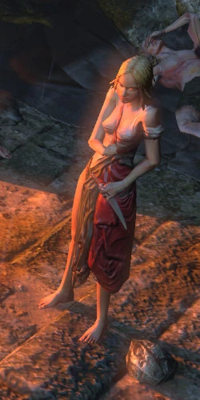
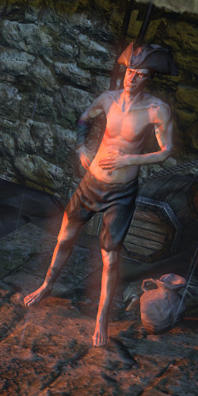

# Overview

## Video Guide

_This Link will open Youtube_

## Progression

| Zone                | To-Do                         | Notes                                                                                  |
| ------------------- | ----------------------------- | -------------------------------------------------------------------------------------- |
| Twilight Strand     | Kill Hillock                  | Hillock is a guranteed Lvl Up, no need to kill anything else here                      |
| 1st Town Visit      | Initial Active Skill          | Tarkleigh: Lvl 1 Skill Gem Reward                                                      |
| Coast               | Rush to WP                    | No need to kill Enemies here, next two Zones will suffice to reach Lvl 4               |
| Mud Flats           | Unlock Submerged              |                                                                                        |
| Submerged Passage   | WP to Coast                   |                                                                                        |
| Coast               | Enter Tidal Island            |                                                                                        |
| Tidal Island        | Kill Hillraik                 | You want to be Lvl 4 to use MS Skill and Quicksilver Flask after Hillraik Kill         |
| 2nd Town Visit      | Lvl 4 Support & Active Gems   | Nessa: Quicksilver, Lvl 4 Support Gem, Tarkleigh: Lvl 4 Skill Gem                      |
| Submerged Passage   | Place Portal at Bridge        |                                                                                        |
| Submerged Passage   | Get to Ledge                  |                                                                                        |
| Ledge               | Get to Climb                  |                                                                                        |
| Climb               | Get to Lower Prison           |                                                                                        |
| Lower Prison        | WP to Town                    |                                                                                        |
| 3rd Town Visit      | Take Portal                   | Early Nessa Lvl 8 Support Gem, recommended to wait till 4th.                           |
| Submerged Passage   | Get to Flooded Depths         |                                                                                        |
| Flooded Depths      | Kill Deep Dweller             |                                                                                        |
| 4th Town Visit      | Pasive Point & Lvl 8 Supports |                                                                                        |
| Lower Prison        | Clear the Trial               |                                                                                        |
| Lower Prison        | Get to Upper Prison           |                                                                                        |
| Upper Prison        | Kill Brutus                   | [Optional] Flask Strongbox                                                             |
| 5th Town Visit      | Lvl 10 Movement Skill         | Tarkleigh: Lvl 10 Movement Skills                                                      |
| Prisoner's Gate     | Get to Ship Graveyard         |                                                                                        |
| Ship Graveyard      | Place Portal at Cave Entrance |                                                                                        |
| Ship Graveyard      | Get to Cavern of Wrath        |                                                                                        |
| Cavern of Wrath     | WP to Town                    |                                                                                        |
| 6th Town Visit      | Lvl 12 Skill, take Portal     | Nessa: Lvl 12 Skill Gem                                                                |
| Ship Graveyard      | Enter Ship Graveyard Cave     |                                                                                        |
| Ship Graveyard Cave | Get Allflame                  |                                                                                        |
| Ship Graveyard      | Kill Fairgraives              |                                                                                        |
| 7th Town Visit      | Passive Point                 | Bestel: Passive Point, get rest of your Act 1 Gems now or when revisiting during Act 2 |
| Cavern of Wrath     | Get to Cavern of Anger        |                                                                                        |
| Cavern of Anger     | Kill Merveil                  | Aim to be Level 11.5 - 12 when killing Merveil                                         |

## Town NPCs

### Nessa

Nessa sells Wands, Jewellery, and Gems.
She also gives several Rewards during Act 1.

### Bestel

Bestel gives a couple of Quest Rewards.

### Tarkleigh

Tarkleigh sells Armour and Weapons
He also gives some Quest Rewards.
