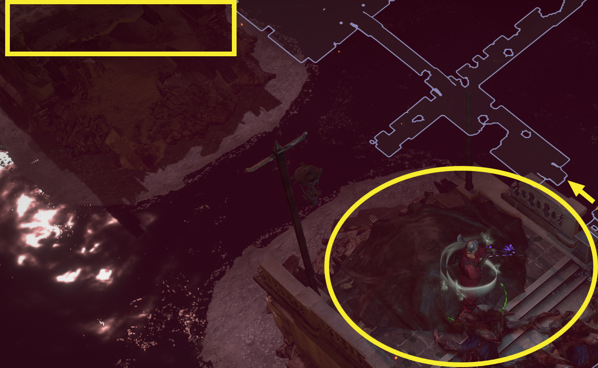

# Canals

## Layouts

| T-Section West Deadend                                                                | T-Section East Deadend                                                                         |
| ------------------------------------------------------------------------------------- | ---------------------------------------------------------------------------------------------- |
| .png>)                         | .png>)                                  |
| 2nd T-Section West for Skip .png>) | Skip North on the first open Section .png>) |

## Zone Read

:::tip Simple Read
Follow Zone. Move North if able to
:::

Canals has 2 Variants. Distinguishable by the first T-Section after the first Bridge. Check West Tunnel first.

- If West Tunnel is a Dead End, it is the East Variant.  
  Follow the Tunnel East. You are either forced in a Ziz Zag until you reach the next Bridge or get a 2nd T-Section.
- - If you have another T-Section and have Blink Arrow / Lightning Warp move West to find a Skip across a broken Bridge.

Continue to follow the Passage, on the Open Zone / Crosssection stick to the West Edge. afterwards follow the next Passage till you find a 2nd open Zone. The Correct Exit to the 2nd Open Zone is North. After its West into the final Passage to find the Exit to Feeding Through.

- IF the West Tunnel continues, we got the West Variant.
  Follow the Passage.
- - If you reach a open Area, there is a Skip available North with Blink Arrow / Lightning Warp. then head North to reach the Open Area.
- - Otherwsie you reach a T-Section choose South here, and continue to follow the Passage till you reach the Open Area.

Go Straight Across the open Area and after North-East to find the final Passage leading to the Entrance to Feeding Through.
