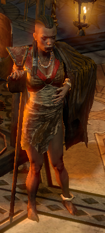
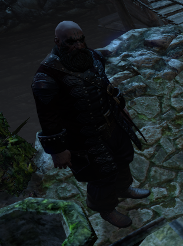
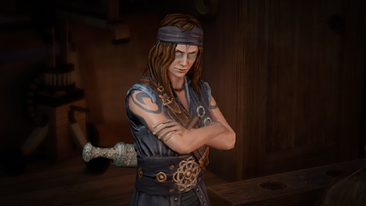

# Overview

## Video Guide

<iframe
  width="560"
  height="315"
  src="https://www.youtube.com/embed/T4igRJv93xg"
  title="YouTube video player"
  frameborder="0"
  allow="accelerometer; autoplay; clipboard-write; encrypted-media; gyroscope; picture-in-picture"
  allowfullscreen
></iframe>
Placeholder Video, actual Video coming once created and edited.

## Progression

| Zone                | To-Do                                          | Notes                                  |
| ------------------- | ---------------------------------------------- | -------------------------------------- |
| 1st Town Visit      | Get to Cathedral Rooftop                       |                                        |
| Cathedral Rooftop   | Save Bannon                                    |                                        |
| Cathedral Rooftop   | Get to Ravaged Square                          |                                        |
| Ravaged Square      | Place Portal at the Blood Fountain             |                                        |
| Ravaged Square      | Get to WP                                      |                                        |
| Ravaged Square      | Get to Torched Courts                          |                                        |
| Torched Courts      | Get to Desecrated Chambers                     |                                        |
| Desecrated Chambers | Kill Avariaus and collect Staff of Avarius     |                                        |
| Desecrated Chambers | Get to WP                                      |                                        |
| 2nd Town Visit      | Take Portal to Ravaged Square                  |                                        |
| Ravaged Square      | Get to Control Blocks                          |                                        |
| Control Blocks      | Kill Vilenta                                   |                                        |
| 3rd Town Visit      | Talk to Bannon, talk to Lani for Quest Rewards | Lani: Rare Body Armour & Passive Point |
| 3rd Town Visit      | Take WP to Ravaged Square                      |                                        |
| Ravaged Square      | Talk to Innocence to unlock Cannals            |                                        |
| Ravaged Square      | Enter Ossuary                                  |                                        |
| Ossuary             | Complete the Trial                             |                                        |
| 3rd Lab             | Do your 3rd Lab now                            |                                        |
| 4th Town Visit      | WP to Ravaged Square                           |                                        |
| Ravaged Square      | Enter Cannals                                  |                                        |
| Cannals             | Get to Feeding Through                         |                                        |
| Feeding Through     | Kill Kitava                                    |                                        |
| 5th Town Visit      | Passive Point and enter Endgame                | Lani : 2 Passive Points                |
| Karui Shores        | Movement Speed Craft                           |                                        |

## Town NPCs

| Lani                                   | Weylam                                                    | Lilly                                      | Bannon                                                                      | Faustus                                            |
| -------------------------------------- | --------------------------------------------------------- | ------------------------------------------ | --------------------------------------------------------------------------- | -------------------------------------------------- |
|  |  |        |                             |  |
| Lani sells Wands and Jewellery.        | Weylam sells Armour and Weapons.                          | Lilly offers Respecilisation and Gambling. | Bannon replaces Utula in Town after talking to him in Chamber of Innocence. | Faustus offers Respecilisation and Gambling.       |
