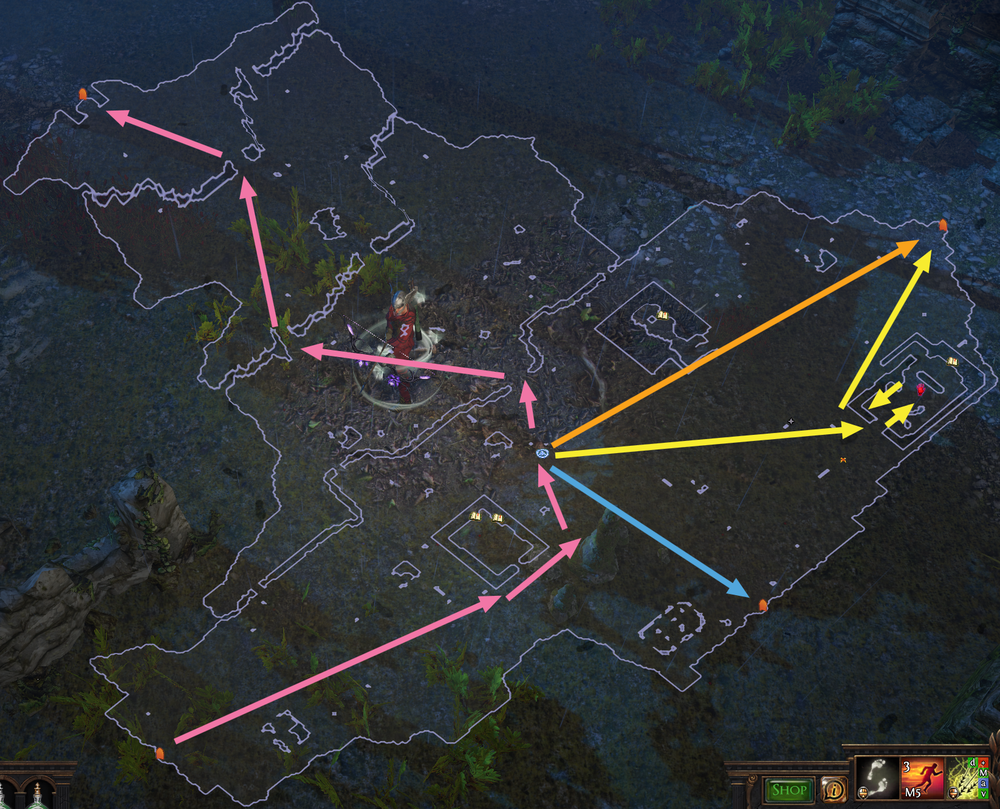

# Crossroads

## Layouts

| Static Layout                                           |
| ------------------------------------------------------- |
|  |

### Points of Interest

Waypoint
Breach in ruined Cathedral

## Zone Read

Crossroads has always a static Layout, the Waypoint is always in the center of the Zone. From there the Exit to Chamber of Sins is to the North-West.
Broken Bridge Entrance is North-East of the Waypoint. If you need Exp, you can take the alternative route, marked in the Image above in Yellow, to open the Breach.
To the South-East you will always find the Entrance to Fellshrine Ruins.
