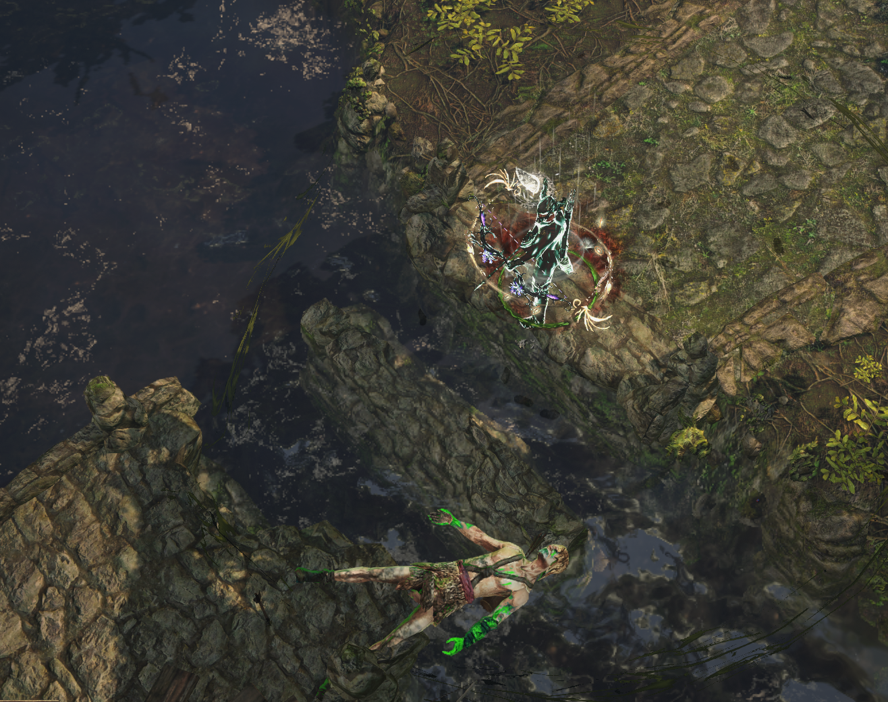

# Riverways

## Layouts

| Continue at Waypoint                                                        | Reset at Waypoint                                                           |
| --------------------------------------------------------------------------- | --------------------------------------------------------------------------- |
| Late Waypoint .png>) | Late Waypoint .png>) |

### Points of Interest

Forsaken Bandit Camp with Breach  
Waypoint

:::danger Warning

The Broken Bridges can only be crossed with Dash Skills other than Blink.  
Lightning Warp, Blink Arrow, Flame Dash, Frostblink, and Leap Slam
:::

## Zone Read

:::tip Simple Read
Follow the Road
:::

The Road in Riverways will always connect Western Forest and Forest Encampment.
The Exit to Wetlands will always be North-West of the Waypoint, a worn old path connects the Waypoint to the Entrance, you can see leftovers of the Road still.

If the Waypoint appears super early into the Zone, like Seconds after entering, reset the Zone from the Waypoint.
In most Variants the Waypoint appears either in the Middle or towards the Western Forest Entrance. The Reset should save you some time.
