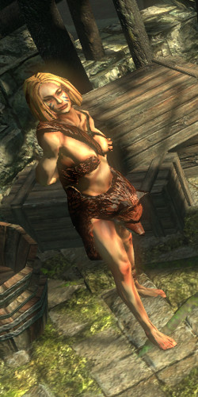
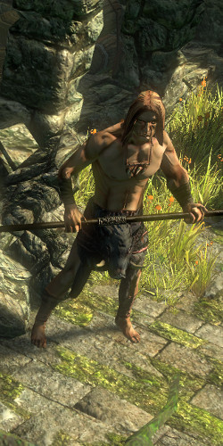
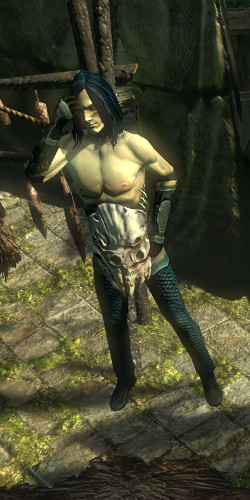

# Overview

## Video Guide

<iframe
  width="560"
  height="315"
  src="https://www.youtube.com/embed/T4igRJv93xg"
  title="YouTube video player"
  frameborder="0"
  allow="accelerometer; autoplay; clipboard-write; encrypted-media; gyroscope; picture-in-picture"
  allowfullscreen
></iframe>
Placeholder Video, actual Video coming once created and edited.

## Progression

:::tip Cyclon's Note

The recommended Path helps Alira for 15% all Elemental Resistances.  
If you want to help Oak for +40 Flat Life  
or help Kraitlin for 8% Movement Speed  
or kill all for 1 Passive Point from Eramir  
Do the Zone of whom you help last and kill all other first, if you kill all, don't forget to get the Apex in Town.

:::

| Zone              | To-Do                                                        | Notes                                                                             |
| ----------------- | ------------------------------------------------------------ | --------------------------------------------------------------------------------- |
| Southern Forest   | Get to Town                                                  |                                                                                   |
| 1st Town Visit    | Get to Old Fields                                            |                                                                                   |
| `Old Fields`      | `[Optional] Place Portal at Den Entrance`                    | `The whole Optional Chain here is only for 2. Quicksilver Flask`                  |
| Old Fields        | Get to Crossroads                                            |                                                                                   |
| Crossroads        | Get to WP                                                    |                                                                                   |
| `Crossroads`      | `[Optional] WP To Town`                                      |                                                                                   |
| `opt. Town Visit` | `[Optional] Take Portal, enter Den`                          |                                                                                   |
| `Den`             | `[Optional] Kill White Beast`                                |                                                                                   |
| `opt. Towv visit` | `2. Quicksilver Flask`                                       | `Yeena: Magic Quicksilver Flask`                                                  |
| Crossroads        | Get to Chamber of Sins                                       |                                                                                   |
| Chamber of Sins   | Get to Chamber of Sins 2                                     |                                                                                   |
| Chamber of Sins 2 | Complete the Trial                                           |                                                                                   |
| Chamber of Sins 2 | Kill Fidelitas and collect Baleful Gem                       |                                                                                   |
| 2nd Tow Visit     | Lvl 16 Skills (Utility and Heralds)                          | Greust: Lvl 16 Skill Gem                                                          |
| Riverways         | Get to WP                                                    |                                                                                   |
| Riverways         | Get to Western Forest                                        |                                                                                   |
| Western Forest    | Get to WP                                                    |                                                                                   |
| Western Forest    | Get to Weaver's Chamber                                      |                                                                                   |
| Weaver's Chamber  | Kill Weaver and collect Weaver's Spike                       |                                                                                   |
| 3rd Town Visit    | Lvl 18 Support Gems                                          | Silk: Lvl 18 Support Gem                                                          |
| Crossroads        | Get to Broken Bridge                                         |                                                                                   |
| Broken Bridge     | Kill Kraitlin                                                |                                                                                   |
| Broken Bridge     | Portal/Log to Town, use WP to get to Wetlands                |                                                                                   |
| 4th Town Visit    | Take WP to Riverways, enter Wetlands                         |                                                                                   |
| Wetlands          | Kill Oak                                                     |                                                                                   |
| Wetlands          | Get to WP                                                    |                                                                                   |
| Western Forest    | Kill / Help Alira                                            | Do not forget to collect the Apex!                                                |
| Western Forest    | Open Blockage                                                |                                                                                   |
| 5th Town Visit    | Collect Apex from Eramir, if killed all Bandits              |                                                                                   |
| Act 1 Town Visit  | Passive Point, take WP to Crossroads, enter Fellshrine Ruins | Bestel: Passive Point, get rest of Act 1 Gems from Nessa                          |
| Felshrine Ruins   | Get to Crypt                                                 |                                                                                   |
| Crypt             | Complete the Trial                                           | Portal to Town here!, Log would send you to Act 1 Town                            |
| 6th Town Visit    | Take WP to Wetlands                                          |                                                                                   |
| Wetlands          | Enter Vaal Ruins                                             |                                                                                   |
| Vaal Ruins        | Release Darkness, get to Northern Forest                     |                                                                                   |
| Northern Forest   | Get to Caverns                                               | Rituals offer great Exp and a guranteed random Omen                               |
| Caverns           | Get to Ancient Pyramid                                       |                                                                                   |
| Ancient Pyramid   | Kill Vaal Oversoul                                           | Recommended to portal or log to Town, sell to Vendors and Take WP to City of Sarn |

## Town NPCs

| Yeena                                    | Greust                                     | Silk                                      | Eramir                                                                             |
| ---------------------------------------- | ------------------------------------------ | ----------------------------------------- | ---------------------------------------------------------------------------------- |
|  |  |     |                                                         |
| Yeena sells Wands, Jewellery, and Gems.  | Greust sells Armour and Weapons.           | Silk offers Respecilisation and Gambling. | Eramir gives the Passive Point reward and Apex, if you choose to kill all Bandits. |
