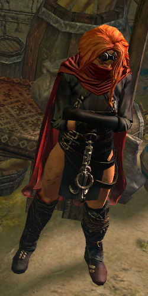
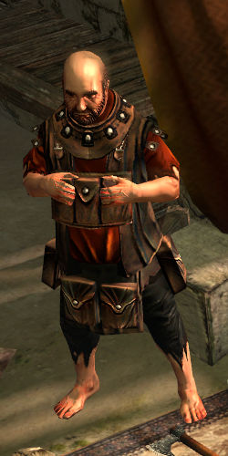
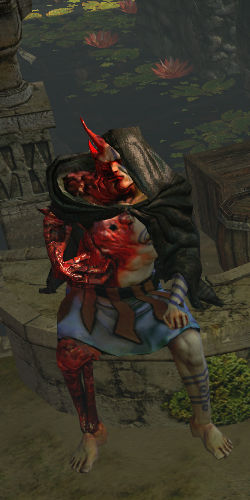

# Overview

## Video Guide

<iframe
  width="560"
  height="315"
  src="https://www.youtube.com/embed/vZnaER2vYbw"
  title="YouTube video player"
  frameborder="0"
  allow="accelerometer; autoplay; clipboard-write; encrypted-media; gyroscope; picture-in-picture"
  allowfullscreen
></iframe>

## Progression

| Zone              | To-Do                                             | Notes                                                                                                                                |
| ----------------- | ------------------------------------------------- | ------------------------------------------------------------------------------------------------------------------------------------ |
| City of Sarn      | Talk to Clarissa                                  | Kill all Blackguard Members for Clarissa to stand up and be interactable                                                             |
| City of Sarn      | Get to Town                                       |                                                                                                                                      |
| 1st Town Visit    | Get to Slums                                      |                                                                                                                                      |
| Slums             | Get to Crematorium                                |                                                                                                                                      |
| Crematorium       | Complete the Trial                                |                                                                                                                                      |
| Crematorium       | Kill Piety and collect Tolmen's Bracelet          |                                                                                                                                      |
| 2nd Town Visit    | Lvl 24 Skills (Curses and Auras) and get to Slums | Marmoa: Lvl 24 Skill Gem                                                                                                             |
| Slums             | Unlock Sewers                                     |                                                                                                                                      |
| Sewers            | Get the WP                                        |                                                                                                                                      |
| Sewers            | Collect the 3 Busts                               |                                                                                                                                      |
| Sewers            | Get to Marketplace                                |                                                                                                                                      |
| Marketplace       | Get the WP and enter Catacombs                    |                                                                                                                                      |
| Catacombs         | Complete the Trial                                |                                                                                                                                      |
| 3rd Town Visit    | Passive Point                                     | Hargan: Passive Point, also check for 4Links if Lvl 23+                                                                              |
| Marketplace       | Get to Battlefront                                |                                                                                                                                      |
| Battlefront       | Get to WP                                         |                                                                                                                                      |
| Battlefont        | Collect Spool                                     |                                                                                                                                      |
| Battlefront       | Get to Docks                                      | If you are not Level 23 1/2 yet, go to Solaris Temple 1 first                                                                        |
| Docks             | Get Thaumatic Sulphite                            | Great Zone for EXP                                                                                                                   |
| 4th Town Visit    | Use WP to get to Battlefront                      |                                                                                                                                      |
| Battlefront       | Get to Solaris Temple 1                           |                                                                                                                                      |
| Solaris Temple 1  | Get to Solaris Temple 2                           |                                                                                                                                      |
| Solaris Temple 2  | Talk to Diala                                     | Diala: Rare Amulet                                                                                                                   |
| Solaris Temple 2  | Use WP to get to Sewers                           | Alternative if fire caster or elemental Attack Build, collect the Flat Fire Craft and craft on your Weapon(s). Then use WP to Sewers |
| Sewers            | Unlock Blockage and get to Ebony Baracks          |                                                                                                                                      |
| Ebony Baracks     | Get to WP                                         |                                                                                                                                      |
| Ebony Baracks     | `[Optional] Kill Gravicus for Lvl 28 Skill Gems`  |                                                                                                                                      |
| Ebony Baracks     | Get to Lunaris Temple 1                           |                                                                                                                                      |
| Lunaris Temple 1  | Get to Lunaris Temple 2                           |                                                                                                                                      |
| Lunaris Temple 2  | Kill Piety and collect Tower Key                  |                                                                                                                                      |
| 5th Town Visit    | Passive Point, Lvl 28 Skills                      | Grigor: Passive Point, Maramoa: Lvl 28 Skill Gem                                                                                     |
| Ebony Baracks     | Get to Imperial Garden                            |                                                                                                                                      |
| Imperial Garden   | Get to WP                                         |                                                                                                                                      |
| `Imperial Garden` | `[Optional] Get to Library`                       |                                                                                                                                      |
| `Library`         | `Get to WP, then to ARchives`                     |                                                                                                                                      |
| `Archives`        | `Collect the 4 golden Pages`                      |                                                                                                                                      |
| `opt. Town Visit` | `Use WP to get to Library`                        |                                                                                                                                      |
| `Library`         | `Level 31 and offclass Support Gems`              |                                                                                                                                      |
| Imperial Garden   | Complete the Trial                                |                                                                                                                                      |
| `Early Lab 1`     | `Starting Lvl 28 you can do early Lab`            |                                                                                                                                      |
| Imperial Garden   | Get to Sceptre of God                             |                                                                                                                                      |
| Sceptre of God 1  | Get to Sceptre of God 2                           |                                                                                                                                      |
| Sceptre of God 2  | Kill Dominus                                      |                                                                                                                                      |

## Town NPCs

| Clarissa                                       | Hargan                                     | Maramoa                                      | Grigor                                                                                                                                    |
| ---------------------------------------------- | ------------------------------------------ | -------------------------------------------- | ----------------------------------------------------------------------------------------------------------------------------------------- |
|  |  |  |                                                                                                 |
| Clarissa sells Wands, Jewellery, and Gems.     | Hargan sells Armour and Weapons.           | Maramoa offers Respecilisation and Gambling. | Grigor offers 1 Passive Point as a Quest Reward after killing Piety in Lunaris Temple 2. You can find him at the far west end of the Town |
