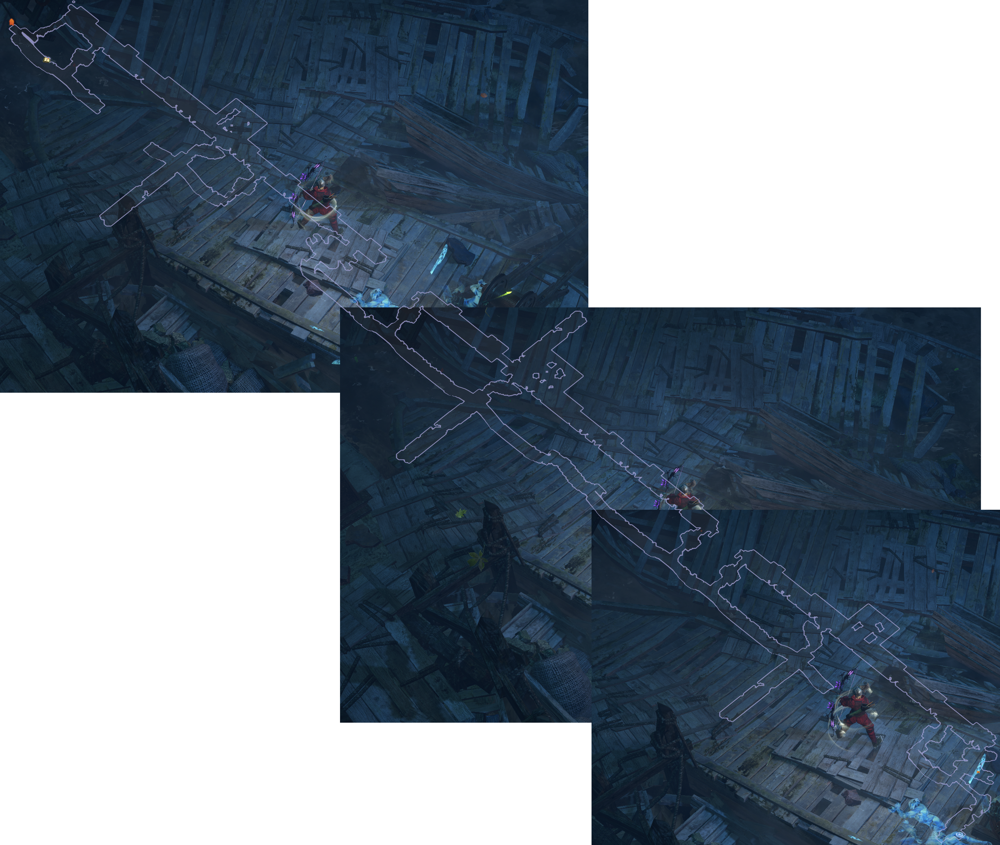

# Aqueduct

## Layouts

| Image to small for Arrows                |
| ---------------------------------------- |
|  |

### Points of Interest

Waypoint  
Dead Ends to West/East have Blue Packs at the End

## Zone Read

Zone has 2 paralel Walkways, divided by the Water in the middle. Each Side can have Dead Ends splitting of East or West. Those Dead Ends contain a guranteed Blue Pack, if you need Experience, Aqueduct is a great Source.

If the Walkway ends, there is always a Bridge crossing over the Water to the other side.
