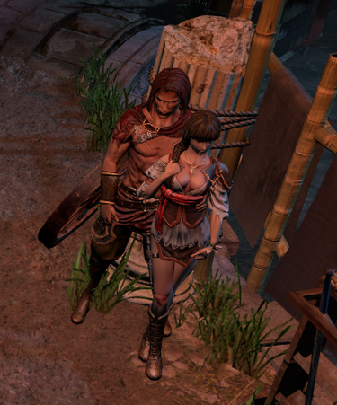
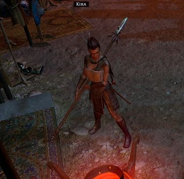
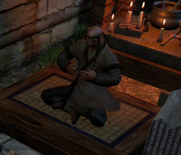
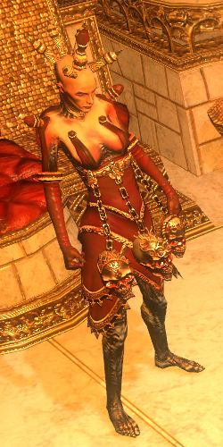
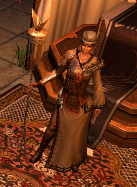

# Overview

## Video Guide

<iframe
  width="560"
  height="315"
  src="https://www.youtube.com/embed/CQeDzbEimYU"
  title="YouTube video player"
  frameborder="0"
  allow="accelerometer; autoplay; clipboard-write; encrypted-media; gyroscope; picture-in-picture"
  allowfullscreen
></iframe>

## Progression

| Zone                 | To-Do                                          | Notes                                                                                                                      |
| -------------------- | ---------------------------------------------- | -------------------------------------------------------------------------------------------------------------------------- |
| Aqueduct             | Get to Town                                    |                                                                                                                            |
| 1st Town Visit       | Get to Dried Lake                              |                                                                                                                            |
| Dried Lake           | Kill Voll and collect the Banner               |                                                                                                                            |
| 2nd Town Visit       | Unlock and enter the Mines                     |                                                                                                                            |
| Mines                | Get to Mines 2                                 |                                                                                                                            |
| Mines 2              | Free Deshret                                   |                                                                                                                            |
| Mines 2              | Get to Crystal Veins                           |                                                                                                                            |
| Crystal Veins        | Get to WP                                      | Aim to hit Lvl 31 here                                                                                                     |
| 3rd Town Visit       | Passive Point                                  | Tasuni: Passive Point                                                                                                      |
| Lab 1                | Get to Act 2 Town and enter Aspirant's Plaza   | If you have not Done Lab before, now is the time to do Lab                                                                 |
| 4th Town Visit       | WP to Crystal Cavern and enter Daresso's Dream |                                                                                                                            |
| Daresso's Dream      | Get to Grand Arena                             |                                                                                                                            |
| Grand Arena          | Kill Daresso and collect the Eye of Desire     | Portal to Town places you right next to WP                                                                                 |
| 5th Town Visit       | Wp to Crystal Cavern and enter Kaom's Dream    |                                                                                                                            |
| Kaom's Dream         | Get to Kaom's Stronghold                       |                                                                                                                            |
| Kaom's Stronghold    | Kill Kaom and collect the Eye of Fury          | Portal to Town places you right next to WP                                                                                 |
| 5th Town Visit       | WP to Crystal Cavern                           |                                                                                                                            |
| Crystal Cavern       | Unlock and enter Belly of the Beast            |                                                                                                                            |
| Belly of the Beast 1 | Get to Belly of the Beast 2                    |                                                                                                                            |
| Belly of the Beast 2 | Kill & Talk to Piety and enter Harvest         |                                                                                                                            |
| Harvest              | Kill Doedre, Maligaro and Shavronne            | Portal to Town and enter from WP after Boss on Right and 2nd Boss on the Left can be faster (depending on Loadscreen time) |
| Harvest              | Kill Malachai                                  |                                                                                                                            |
| 6th Town Visist      | Lvl 34 and 38 Skill / Support Gems             | Oyun: 34 Skill Gem, Dialla: 38 Support Gem                                                                                 |
| Ascent               | Get to Portal Device and enter Slave Pens      |                                                                                                                            |

## Town NPCs

| Petarus and Vanja                                       | Kira                           | Tasuni                                                                                                     | Daila                                          | Oyun                       |
| ------------------------------------------------------- | ------------------------------ | ---------------------------------------------------------------------------------------------------------- | ---------------------------------------------- | -------------------------- |
|  |   |                                                                                 |  |     |
| Petarus and Vanja sell Wands, Jewellery, and Gems.      | Kira sells Armour and Weapons. | Tasuni offers Respecilisation and Gambling. He can also trade in any Div Cards you collect during Campaign | Diala offers a Quest Reward                    | Oyun offers a Quest Reward |
