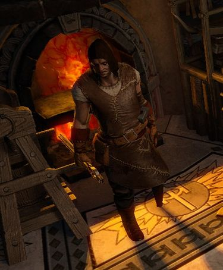
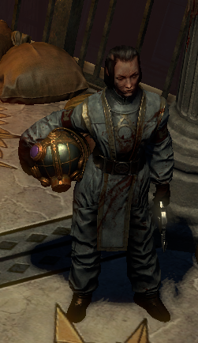
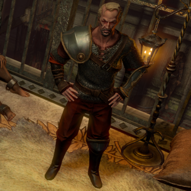

# Overview

## Video Guide

<iframe
  width="560"
  height="315"
  src="https://www.youtube.com/embed/QAdV91tmTMc"
  title="YouTube video player"
  frameborder="0"
  allow="accelerometer; autoplay; clipboard-write; encrypted-media; gyroscope; picture-in-picture"
  allowfullscreen
></iframe>

## Progression

| Zone                 | To-Do                                                            | Notes                                       |
| -------------------- | ---------------------------------------------------------------- | ------------------------------------------- |
| Slave Pens           | Kill Overseer Krow and enter Town                                |                                             |
| 1st Town Visit       | Get to Control Blocks                                            | Lani: Rare Ring                             |
| Control Blocks       | Collect Miasmeter                                                |                                             |
| Control Blocks       | Kill Justicar Casticus and collect Eyes of Zeal                  |                                             |
| Control Blocks       | Enter City Square                                                |                                             |
| Oriath Square        | Unlock and enter Courthouse                                      |                                             |
| Courthouse           | Get to Chamber of Innocence                                      |                                             |
| Chamber of Innocence | Kill Innocence                                                   |                                             |
| Torched Courts       | Get to Ruined Square                                             |                                             |
| Ruined Square        | Get to WP                                                        |                                             |
| Ossuary              | Get Sign of Purity                                               |                                             |
| Ruined Square        | Place Portal at the Middle of Big Square, next to Blood Fountain |                                             |
| Ruined Square        | Get to Reliquary                                                 |                                             |
| Reliquary            | Collect the 3 Kitava's Torment Relics                            |                                             |
| 2nd Town Visit       | Passive Points                                                   | Vilenta: Passive Point, Lani: Passive Point |
| 2nd Town Visit       | Take Portal to Ruined Square                                     |                                             |
| Ruined Square        | Enter Cathedral Rooftop                                          |                                             |
| Cathedral Rooftop    | Kill Kitava                                                      |                                             |

## Town NPCs

### Nessa

| Lani                                   | Utula                               | Vilenta                                      | Bannon                                                                      |
| -------------------------------------- | ----------------------------------- | -------------------------------------------- | --------------------------------------------------------------------------- |
|  |  |  |                             |
| Lani sells Wands and Jewellery.        | Utula sells Armour and Weapons.     | Vilenta offers Respecilisation and Gambling. | Bannon replaces Utula in Town after talking to him in Chamber of Innocence. |
