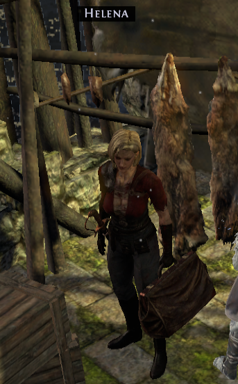
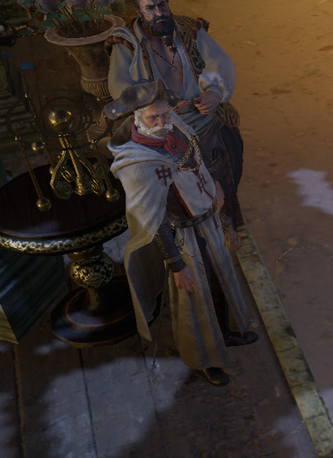
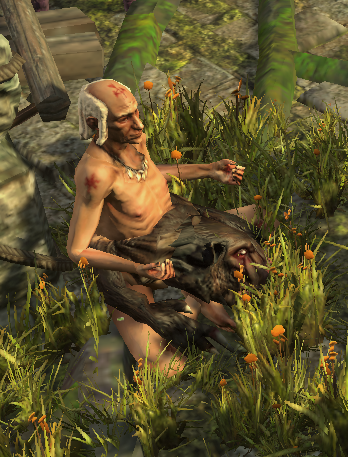

# Overview

## Video Guide

<iframe
  width="560"
  height="315"
  src="https://www.youtube.com/embed/T4igRJv93xg"
  title="YouTube video player"
  frameborder="0"
  allow="accelerometer; autoplay; clipboard-write; encrypted-media; gyroscope; picture-in-picture"
  allowfullscreen
></iframe>
Placeholder Video, actual Video coming once created and edited.

## Progression

| Zone                | To-Do                                                    | Notes                                                                                                       |
| ------------------- | -------------------------------------------------------- | ----------------------------------------------------------------------------------------------------------- |
| 1st Town Visit      | Enter Broken Bridge                                      |                                                                                                             |
| `Broken Bridge`     | `[Optional] Get Silver Locket in Castle`                 | `Gives a Flask from Weylam`                                                                                 |
| Broken Bridge       | Get to Crossroads                                        |                                                                                                             |
| Crossroads          | Get to WP                                                |                                                                                                             |
| Crossroads          | Get to Fellshrine Ruins                                  |                                                                                                             |
| Fellshrine Ruins    | Get to Crypt                                             |                                                                                                             |
| Crypt               | Complete the Trial                                       |                                                                                                             |
| Crypt               | Collect Maligaro's Map                                   |                                                                                                             |
| 2nd Town Visit      | `[Optional] Quest Reward`, WP to Crossroads              |                                                                                                             |
| Crossroads          | Get to Chamber of Sins                                   |                                                                                                             |
| Chamber of Sins 1   | Get to Map Device and open Map                           |                                                                                                             |
| Maligaro's Sanctum  | Kill Maligaro                                            |                                                                                                             |
| Chamber of Sins 1   | Get Key from Silk, Unlock and Enter Chamber of Sins 2    |                                                                                                             |
| Chamber of Sins 2   | Complete the Trial                                       |                                                                                                             |
| Chamber of Sins 2   | Unlock and Enter Den                                     |                                                                                                             |
| Den                 | Get tp Ashen Fields                                      |                                                                                                             |
| Ashen Fields        | Kill Greust / Ralakesh                                   |                                                                                                             |
| Northern Forest     | Get to WP                                                |                                                                                                             |
| `Recommended Lab 2` | `You can do your 2nd Lab here or delay till Start of A8` |                                                                                                             |
| Northern Forest     | Place Portal at Dread Thicket Entrance                   |                                                                                                             |
| Northern Forest     | Get to Causeway                                          |                                                                                                             |
| Causeway            | Get Kishara's Star                                       |                                                                                                             |
| Causeway            | Enter Vaal City                                          |                                                                                                             |
| Vaal City           | Get to WP                                                |                                                                                                             |
| `3rd Town Visit`    | `[Optional]` Get Greust Necklace                         | `Helena offers Greust Necklace for a rare Amulet, only do this if Portal is close to the Azmeri Shrine too` |
| 3rd Town Vist       | Passive Point                                            | Weylam: Passive Point                                                                                       |
| 3rd Town Visit      | Use Portal and enter Dread Thicket                       |                                                                                                             |
| Dread Thicket       | Collect 7 Fireflies                                      |                                                                                                             |
| Dread Thicket       | Kill Gruthkul                                            |                                                                                                             |
| 4th Town Visit      | Passive Points, Boots                                    | Helena: Rare boots, Rare Amulet, Eramir: 2 Passive Points                                                   |
| Vaal City           | Enter Temple of Decay                                    |                                                                                                             |
| Temple of Decay 1   | Get to Temple of Decay 2                                 |                                                                                                             |
| Temple of Decay 2   | Kill Arakaali                                            |                                                                                                             |

## Town NPCs

| Yeena                                    | Helena                           | Faustus                                            | Eramir                                     | Weylam                                                    |
| ---------------------------------------- | -------------------------------- | -------------------------------------------------- | ------------------------------------------ | --------------------------------------------------------- |
|  |  |  |                 |  |
| Yeena sells Wands & Jewellery.           | Helena sells Armour and Weapons. | Faustus offers Respecilisation and Gambling.       | Eramir gives a Passive Point Quest Reward. | Weylam offers various Quest Rewards                       |
