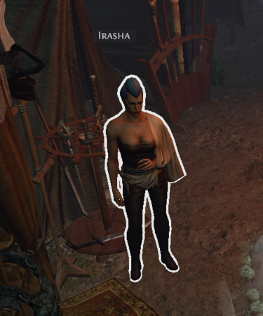
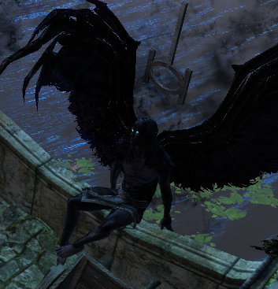

# Overview

## Video Guide

<iframe
  width="560"
  height="315"
  src="https://www.youtube.com/embed/pTUaJ52RtDM"
  title="YouTube video player"
  frameborder="0"
  allow="accelerometer; autoplay; clipboard-write; encrypted-media; gyroscope; picture-in-picture"
  allowfullscreen
></iframe>

## Progression

| Zone               | To-Do                                                            | Notes                                                                                                                                 |
| ------------------ | ---------------------------------------------------------------- | ------------------------------------------------------------------------------------------------------------------------------------- |
| Blood Aquaduct     | Get to Town                                                      | `[Optional] Talk to Sin once`                                                                                                         |
| 1st Town Visit     | Get to Descent                                                   |                                                                                                                                       |
| Descent            | Get to Vastiri Desert                                            |                                                                                                                                       |
| Vastiri Desert     | Get to WP                                                        |                                                                                                                                       |
| Vastiri Desert     | Find and collect the Sand Sword                                  | Can appear before or after WP                                                                                                         |
| Vastiri Desert     | Get to Foothills                                                 |                                                                                                                                       |
| Foothills          | Get to WP and Enter Boiling Lake                                 |                                                                                                                                       |
| Boiling Lake       | Kill Basilisk and collect Basilisk Acid                          |                                                                                                                                       |
| 2nd Town Visit     | Talk to Sin & Petarus and Vanja for Sand Bottle and Quest Reward | Petarus and Vanja: Rare Weapon or Offhand                                                                                             |
| 2nd Town Visit     | WP to Vastiri Desert                                             |                                                                                                                                       |
| Vastiri Desert     | Unlock and Enter Oasis                                           |                                                                                                                                       |
| Oasis              | Kill Shakari                                                     | Portal to Town places you next to the WP                                                                                              |
| 3rd Town Visit     | WP to Foothills                                                  |                                                                                                                                       |
| Foothills          | Get to Tunnel                                                    |                                                                                                                                       |
| Tunnel             | Complete the Trial                                               |                                                                                                                                       |
| Tunnel             | Get to Quarry                                                    |                                                                                                                                       |
| Quarry             | Get to WP                                                        |                                                                                                                                       |
| Quarry             | Get to Refinery                                                  |                                                                                                                                       |
| Refinery           | Collect the Thrathan Powder                                      |                                                                                                                                       |
| 4th Visit          | WP to Quarry                                                     |                                                                                                                                       |
| Quarry             | Unlock Belly of the Beast and go kill Garukhan                   | Logging to Town places you near Irasha for Quests                                                                                     |
| 5th Visit          | Passive Points, then WP to Quarry                                | Irasha: 2 Passive Points                                                                                                              |
| Quarry             | Enter Belly of the Beast                                         |                                                                                                                                       |
| Belly of the Beast | Get to Rotting Core                                              |                                                                                                                                       |
| Rotting Core       | Kill Depraved Trinity                                            | You can portal to Town during the Kill animation. Skipping the Loot, but using WP to get to A10 places you near the Rooftop entrance. |

## Town NPCs

## Town NPCs

| Petarus and Vanja                                       | Irasha                                           | Tasuni                                                        | Faustus                                            | Sin                                            |
| ------------------------------------------------------- | ------------------------------------------------ | ------------------------------------------------------------- | -------------------------------------------------- | ---------------------------------------------- |
|  |  |                                    |  |  |
| Petarus and Vanja sell Wands & Jewellery.               | Irasha sells Armour and Weapons.                 | Tasuni can trade in any Div Cards you collect during Campaign | Faustus offers Respecilisation and Gambling.       | Sin is needed for Quest Chains                 |
