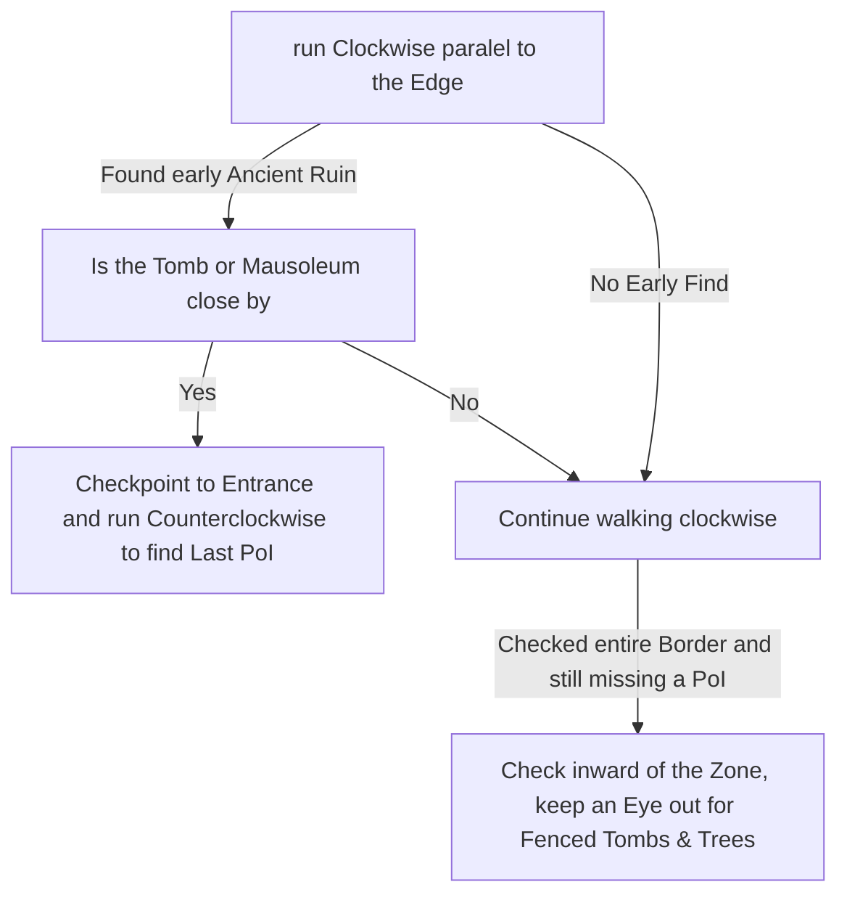

# Cemetery of the Eternals

## Zone Read

:::tip Simple Read
Run the Zone clockwise or counterclockwise along the Edges so they are just barely in view and keep an eye out on the Minimap for Checkpoints and Book Icons.
:::

Cemetery of the Eternals is one of the few non-solved Zones in Act 1.

Tomb of the Consort can be either in a Alcove along the Edge of the Zone or in the Center alongside a fenced Grass Area with Trees and Tombstones.

Mausoleum of the Praetor can either be in a open Alcove along the Edge or inwards, but still in close proximation to the edge.

The Ancient Ruin is at a Random Edge other than the one adjacent to the Waypoint.

Based on the behaviour of each Point of Interest the best aproach is to run the Zone always in the same pattern. Run Clockwise or Counterclockwise paralel to the Edge along the Edge of the Zone. I preffer Clockwise due to what I call the Early find Variant.

:::info Cyclon's Note
I recommend doing a couple practice runs on a fresh Character to get acustomed to the Light / Discover Radius and how to identify the Enviromental Clues for the Tomb & Mausoleum.
:::

## Layouts

### Variant Table

| Early Find Examples                                                                                          | Long Walk Examples                                                                                           |
| ------------------------------------------------------------------------------------------------------------ | ------------------------------------------------------------------------------------------------------------ |
| .png>) | .png>) |
| .png>) | .png>) |

### Points of Interest

Tomb of the Consort Entrance  
Mausoleum of the Praetor  
Ancient Ruin - Normal Lapis or Iron Ring
