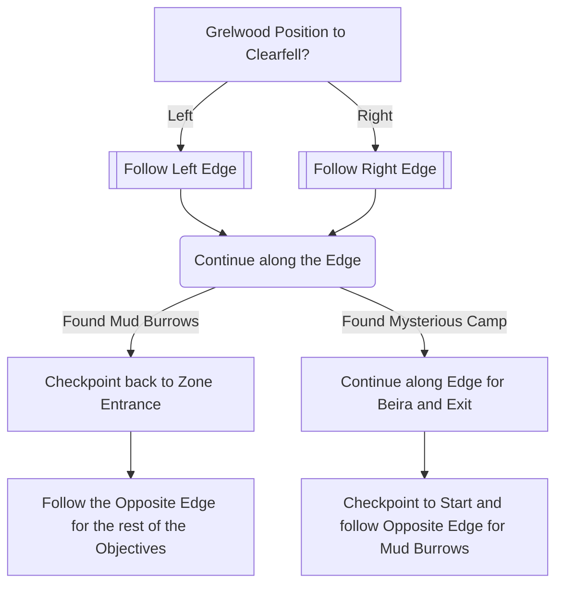

# Clearfell

## Zone Read

:::tip Simple Read
Grelwood and Mud Borrow Entrance align with their relative Position on the Overworld Map.  
If the Grelwood is left of Clearfell, the Exit will be to the Top Left. Stick to the Edge in the direction of the Exit.
:::

Clearfell follows a couple of Layout Rules and contains Enviromental Clues:

- Grelwood Exit aligns with the position of Grelwood to Clearfell in the Overworld
- If you have Landscape Transparency not on 0, you can see the Devourer Path leading to Mud Burrows
- Mud Burrows and the Mysterious Campsite will be opposite to each other. If one is along the Left Edge, the other will be along the Right Edge
- The Mysterious Campsite and Exit to Grelwood are light up by orange Flames, this can help to identify their location.
- Beira will have Voicelines that are audible from before she is vissible, I recommend having 'Output Dialog to Chat' enabled.
- Beira's Arena, the Frostblood Ritual can also be identified by the frozen Logs surrounding it.

## Layouts

### Overworld Examples

|                                                                                                                         |                                                                                                                        |                                                                                                                         |
| ----------------------------------------------------------------------------------------------------------------------- | ---------------------------------------------------------------------------------------------------------------------- | ----------------------------------------------------------------------------------------------------------------------- |
| Town Exit Left and Grelwood Left of Clearfell .png>) | Town Exit Top and Grelwood Left of Clearfell .png>) | Town Exit Top and Grelwood Right of Clearfell .png>) |

### Variant Table

| Town Exit Left and Grelwood Left of Clearfell                                     | Town Exit Top and Grelwood Left of Clearfell                                                     | Town Exit Top and Grelwood Right of Clearfell                                                                                                     |
| --------------------------------------------------------------------------------- | ------------------------------------------------------------------------------------------------ | ------------------------------------------------------------------------------------------------------------------------------------------------- |
| No Bridge, Early Camp .png>)       | Late Bridge, Mud burrow Path leading North .png>) | Mud Borrows along Right Edge, either go 1,2,3 or 1,3 and move Right from Beira to find Exit .png>) |
| No Bridge, Camp after Curve .png>) | Early Bridge, Burrow Path along Left Edge .png>)  | Mysterious Campment along Right Edge .png>)                                                        |

### Points of Interest

Mysterious Campsite - LvL 1 Skill Gem  
Waypoint near Mud Burrow Entrance  
Frostblood Ritual - Kill Beira for 10% Cold Resistance Permanent Buff
