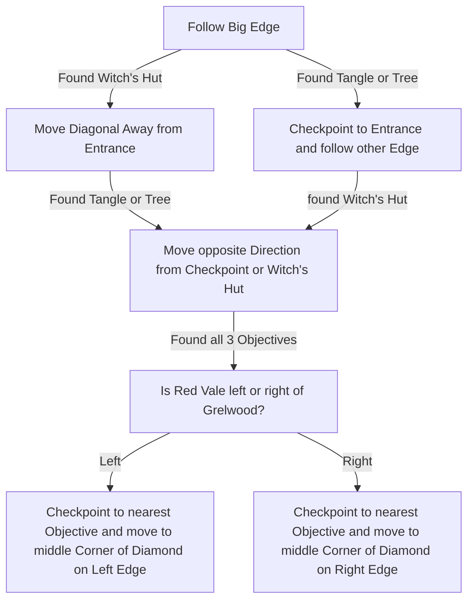

# Grelwood

## Zone Read

:::tip Simple Read
The Zone is roughly in a diamond Shape and you spawn in any of the 4 Corners.  
The Red Vale aligns with its overworld Position. If its left of Grelwood, it is also at the Left Edge of the Zone.
Areagne'ss Hut is almost always the closest Point of Interest to the Entrance.
From there check for the others in a Diamond Pattern for the others.
:::

Grelwood follows a couple of Layout Rules and contains Enviromental Clues:

- Areagne's Hut is roughly opposite to the Brambleghast Arena
- Areagne's Hut is usualy the closest of the 4 Points of Interest to the Spawn
- If you have Landscape Transparency not on 0, you can see the Roof of the Hut on the Minimap as you discover it.
- If you have Landscape Transparency not on 0, you can see the Thorns of the Brambleghast Arena on your Minimap
- The Tree of Souls and Grim Tangle Entrance are roughly opposite to each other.
- Grim Tangle Entrance is surrounded by yellow glowing & exploding Mushrooms
- When aproaching the Tree of Souls the camera zooms slightly out.
- The Red Vale Entrance aligns with its relative Position to Grelwood.
- - If its Left of Grelwood it will be along the Left Edge
- The Red Vale Entrance is next to a River & lit up by a singular Torch

:::info Cyclon's Note
I had the most success stickign to the big Edge(marked in the Variant Table Images), but the read is not optimal.
:::

### Overworld Examples

| Red Vale Left of Grelwood                                      | Red Vale Right of Grelwood |
| -------------------------------------------------------------- | -------------------------- |
|  | ToBeDone                   |

### Variant Table

| Red Vale Left & Entrance Right                                         | Red Vale Left & Entrance bottom                                       | Red Vale Right & Entrance Left | Red Vale Right & Entrance Top |
| ---------------------------------------------------------------------- | --------------------------------------------------------------------- | ------------------------------ | ----------------------------- |
| Curve bottom.png>) | Curve Left .png>) | ToBeDone                       | ToBeDone                      |
| Curve top .png>)   | Curve Right.png>) | ToBeDone                       | ToBeDone                      |

### Points of Interest

Waypoint at the Tree of Souls  
Witch Hut - Medium Life & Mana Flask & Kill Areagne for LvL 1 Support Gem  
Brambleghast - LvL 2 Skill Gem
