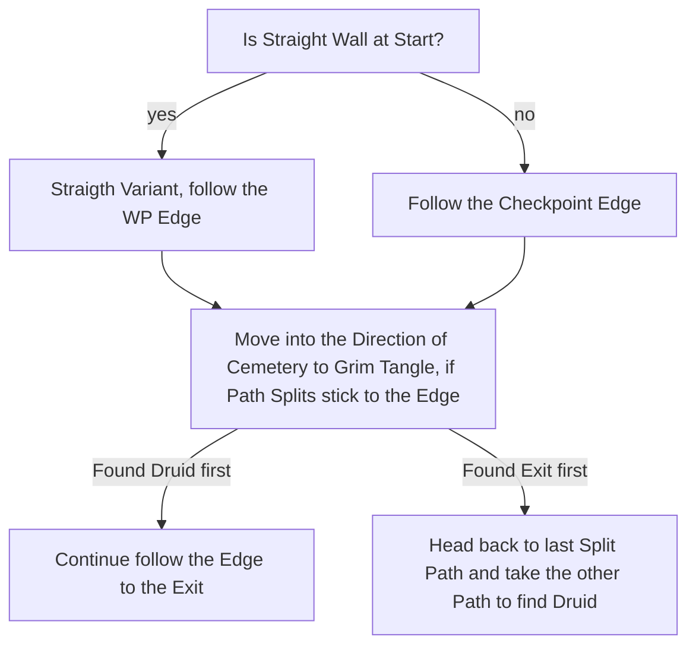

# Grim Tangle

## Zone Read

:::tip Simple Read
Follow the Edge behind the Checkpoint in the relative Direction of the Cemetery of Grim Tangle
:::

There are 4 Layout Categories, based on [Angormus](https://www.youtube.com/@Angormus) definition of the Zone. Regardless if Zone goes from Left to Right, Right to Left, Top to Bottom or Bottom to Top, All Layouts fit into on of the Categories.

- Spiral
- - The Checkpoint Edge leads to Boss Arena behind the Entrance and the Exit is Diagonal in the Direction of the Cemetery
- Hook
- - Zone starts similar to Spiral, but doesnt loop behind Entrance, continues in the Direction of the Cemetery
- V-Shaped?
- - Takes a V ur U Curve depending on Perspective and the Druid can be found in a Split Path near the Exit
- Straight
- - Long straight Wall at the Beginning of the Zone before first Branching of the Path. Stick to Waypoint Edge.

## Layouts

### Overworld Examples

| Cemetery Left of Tangle                                                               | Cemetery Right of Tangle                                                              |
| ------------------------------------------------------------------------------------- | ------------------------------------------------------------------------------------- |
| .png>) | .png>) |

### Variant Table

| Spiral                                                          | Hook                                                            | V-Shaped?                                                       | Straight                                                        |
| --------------------------------------------------------------- | --------------------------------------------------------------- | --------------------------------------------------------------- | --------------------------------------------------------------- |
| .png>) | .png>) | .png>) | .png>) |
| .png>) |                                                                 | .png>) |                                                                 |
|                                                                 |                                                                 | .png>) |

### Points of Interest

Waypoint at the Entrance from Grelwood  
Ervig, the Rotten Druid - LvL 1 Support Gem
