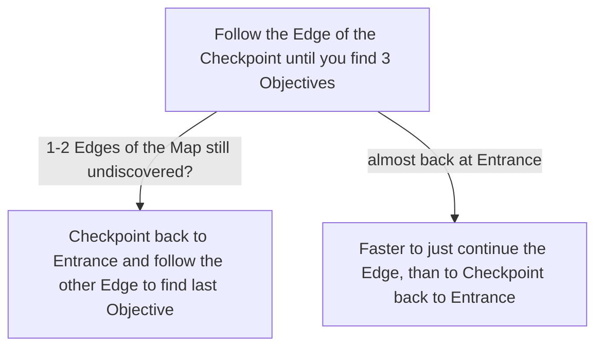

# Hunting Grounds

## Zone Read

:::tip Simple Read
Walk along the Edge of the Zone in the opposite Direction of the Checkpoint.
:::

Hunting Grounds contains 3 Points of Interest and 2 Exits. We care for 2 of the 3 PoI. The 3rd PoI is a Ritual in the Middle of the Zone granting us no reward. So we only have to cover the Edges of the Zone to find everything we care about.

The Zone contains a Dirt Path connecting a fake Exit and the Ogham Farmlands Exit.

:::warning assumed Bug
The Overworld Position of Hunting Grounds to Freythorn and Ogham Farmlands does not align with the Zone Exits.
:::

## Layouts

### Overworld Examples

| Oghma Farmlands Left of Hunting Grounds                                                         | Ogham Farmlands Right of Hunting Grounds                                                          |
| ----------------------------------------------------------------------------------------------- | ------------------------------------------------------------------------------------------------- |
| .png>) | .png>) |

### Variant Table

| Fully Revealed Example                                                      | Minimum Revealed Example                                                                                                                                                        |
| --------------------------------------------------------------------------- | ------------------------------------------------------------------------------------------------------------------------------------------------------------------------------- |
| .png>) | Almost fully Discovered Edge at Crowbell, faster to continue .png>)                                        |
| .png>) | Top Right Edge fully undiscovvered at Ogham Farmlands Exit, return to Entrance and follow other Edge.png>) |

### Points of Interest

Dryadic Ritual - Rare Dryad that drops LvL 1 Support Gem
Crowbell - Rewards 2 Passive & 2 Weapon Set Points
Ritual - Rewards nothing (not highlighted on the Layout Examples above)
