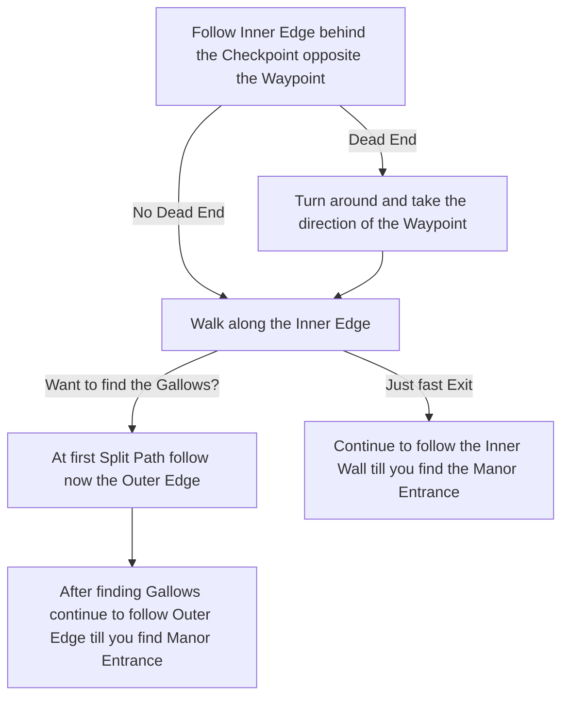

# Manor Ramparts

## Zone Read

:::tip Simple Read
Follow the Inner Edge(behind Checkpoint) to find Manor Entrance directly. The Outer Edge will lead to the Gallows first. Go into the direction opposite to the Waypoint. If it's a Dead End turn around and go in direction of Waypoint.
:::

Manor Ramparts is a overall simple Zone with little variation. It consists of Outer Walls tiles, Building Tiles and Walkway Tiles.

Building Tiles contain a bigger Building and a forked Path that will connect again. Walkway Tiles are open Walkways decorated by small Hedges.

In a League Start Scenario we don't know if the Direction of the Waypoint or opposite to the Waypoint is a Dead End, but it is easy to figure out early. Simply walk in the direction opposite the Waypoint and if you see a Corner, it is the Dead End.

## Layouts

### Variant Table

| Waypoint Dead End                                                      | Opposite to Waypoint Dead End                                                                                                                        | Gallows on Main Path                                                   |
| ---------------------------------------------------------------------- | ---------------------------------------------------------------------------------------------------------------------------------------------------- | ---------------------------------------------------------------------- |
| .png>) | House tile at first Split Path, minor difference to Split of before and after .png>) | .png>) |

### Points of Interest

Gallows - Clicking the Rope drops LvL 1 Support Gem
