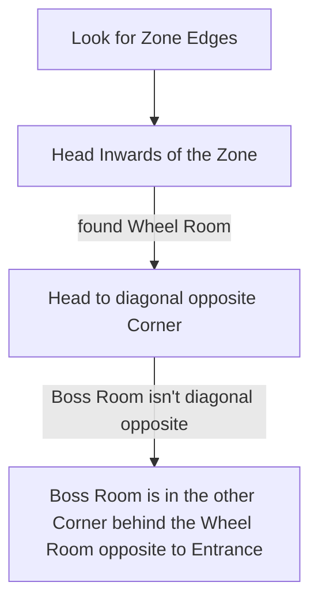

# Mausoleum of the Praetor

## Zone Read

:::tip Simple Read
Find the Center of the Zone, the Wheel or + Room (same Room, just diffrent Naming). Find the Boss Arena opposite of Entrance to the Wheel Room.
:::

The Mausoleum is a 6x7 Rectangle and the Entrance is always near a Map Corner. In the Center of the Zone is a Room with a round Center and 4 Exits. It is either called the Wheel or + Room.

The Boss Room is in 70% of the Cases Diagonal opposite to the Entrance and in 30% paralel opposite, with the Wheel Room as the Middle Point. The Boss Room is further identifiable by its Border, both with and without Landscape Transparency.

:::info Cyclon's Note
Best Zone to learn in Act 1!
:::

## Layouts

### Variant Table

| Diagonal Opposite Boss Arena                                                                                   | Paralel to Entrance Boss Arena                                                                                 |
| -------------------------------------------------------------------------------------------------------------- | -------------------------------------------------------------------------------------------------------------- |
| .png>) | .png>) |
| .png>) | .png>) |
| .png>) |                                                                                                                |

### Points of Interest

Forgotten Riches - Hidden Room with Gold Piles and Rare Chest
Draven - Drops Key Piece for Main Quest Progression
