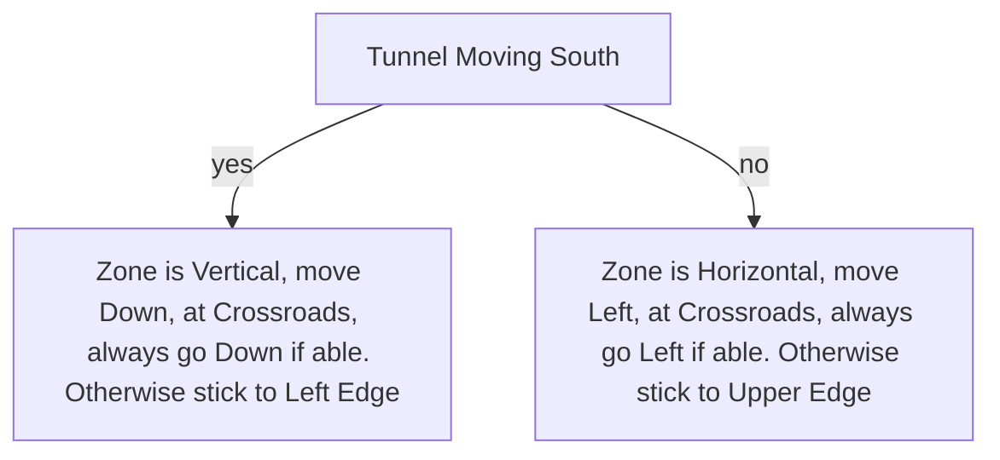

# Mud Burrow

## Zone Read

:::tip Simple Read
The Devourer Chamber is always at the opposite End of the Zone.
The Zone either extends Horizontal or Vertical. Follow the Left Edge till you reach the Devourer.
:::

## Layouts

### Variant Table

| Vertical Variant                                              | Horizontal Variant                                            |
| ------------------------------------------------------------- | ------------------------------------------------------------- |
| .png>) | .png>) |

### Points of Interest

Hatchery - Couple 'Chests' and Enemies  
Devourer - LvL 2 SKill Gem(Drop) & LvL 1 Support Gem(Quest Reward)
