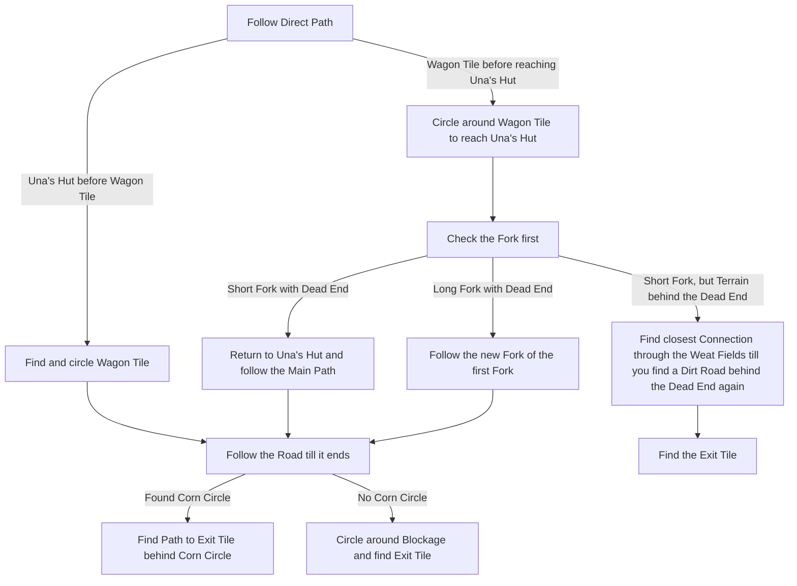

# Ogham Farmlands

## Zone Read

:::tip Simple Read
The Exit aligns with Ogham Village Position to Ogham Farmlands and is at the opposite Edge of the Entrance in the Zone. Follow the Dirt Path, if you reach a Dead End. Return to Una's Hut, there is a split of the Path, follow that.
:::

The Zone orientation aligns with the Position of Ogham Farmlands to Ogham Village.

Ogham Farmlands has 2 Variants, direct Path or Fork. All Layouts can be categorized into these 2 Variants. There is a dirt road leading from Hunting Ground Entrance very close to the the Exit. From there go through the Fields until you find a new dirt Path to follow to the Exit to Ogham Village.

The Main Road also called Direct Path, will early on be blocked by a pile of Wagons, called Wagon Tile. To circle around it find the next opening into the fields and take the first opportunity walking back onto the mainroad.

At Una's Hut the Path Forks, one direction leading to a Dead End the other towards the Exit.

The Exit Tile is also always the same: A Dirt Path connecting 2 blocked Exits surrounded by Corn Fields. With a Crossroad in the middle. Leading to the Entrance to Ogham Village.

## Layouts

### Overworld Examples

| Village left of Farmlands                                                                       | Village right of Farmlands                                                                        |
| ----------------------------------------------------------------------------------------------- | ------------------------------------------------------------------------------------------------- |
| .png>) | .png>) |

### Variant Table

| Direct Path                                                                                                                        | Fork                                                                                                                 |
| ---------------------------------------------------------------------------------------------------------------------------------- | -------------------------------------------------------------------------------------------------------------------- |
| Short Fork Dead End & Direct Path leads to Corn Circle .png>) | Long Fork Path leads to secondary Fork .png>)   |
| Una's Hut before Wagon Tile .png>)                            | Short Fork direct Corn Circle .png>)            |
|                                                                                                                                    | Special Case both Path end near the Exit .png>) |

### Points of Interest

Wagon Tile - Blocks Path, always near Una's Hut  
Una's Hut - Una's Lute Quest Item to get +2 Weapon Set & Skill Points  
Crop Circle - Rare Dog drops LvL 4 Skill Gem
