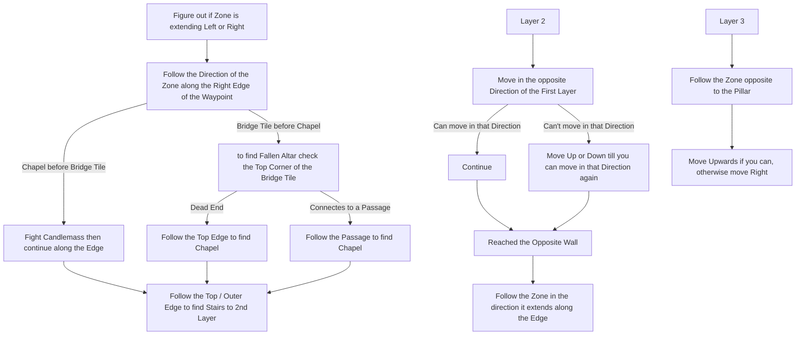

# Ogham Manor

## Zone Read

:::tip Simple Read
First and Second Layer contain a 'Bridge' connection 2 Maze Sections. Move towards the opposite Horizontal Edge then check Up and Down to find the Stair to the lower Level. On Third Floor always go Up and Right to find the Boss Arena.
:::

Ogham Manor consist of 3 Layers connected by Staircases. The first andn second Layer Containa Bridge tile which connects the first and second Section of the Layers. While the Gamefiles contain a Top Left to Bottom Right facing Bridge Tile. All known Layout variants currently spawn with the Bottom Left top Top Right Bridge Tile. So we assume that each Layout has to contain that Tile. Which helps orientating the Layout.

The first Layer always contains the Chapel with the Candlemass Boss Fight. The Chapel can be identified by the Pillars in front of the Checkpoint on the Minimap. The Chapel is usualy behind the Bridge Tile, but can rarely appear before the Bridge Tile.

The Second Layer Direction is always opposite to the First Layer Direction. If first Layer was Left to Right, the second Layer will be Right to Left.

The Third Layer is always Top and Right to find the Boss Arena. To start orienting it always has a Pillar right next to Checkpoint, move opposite that Pillar. Then move Upwards if you can, otherwise move Right.

The Staircase from Layer 1 to Layer 2 is usualy in a big open Room with a Curved Wall next to 2 Stairs. The Staircase from the 2nd Layer to 3rd Layer is in a small Room that looks like a crippled Person (2 Pillars are the Eyes and can be flipped)

## Layouts

### Variant Table

| Floor 1                                                                                                                | Floor 2                                                                       | Floor 3                                                                       |
| ---------------------------------------------------------------------------------------------------------------------- | ----------------------------------------------------------------------------- | ----------------------------------------------------------------------------- |
| Left to Right, Bridge Tile only 1 Exit.png>)                  | Right to Left.png>)  | Left to Right .png>) |
| Right ot Left, Chapel Visible when checking first Wall .png>) | Right to Left .png>) | Bottom to Top .png>) |
| Right to Left, Chapel on the Way.png>)                        |                                                                               |

### Points of Interest

Geonor - Unlocks access to Act 2 in Town & awakes the Hooded one if not done before
Fallen Altar - Kill Candlemass for +20 Maximum Life
