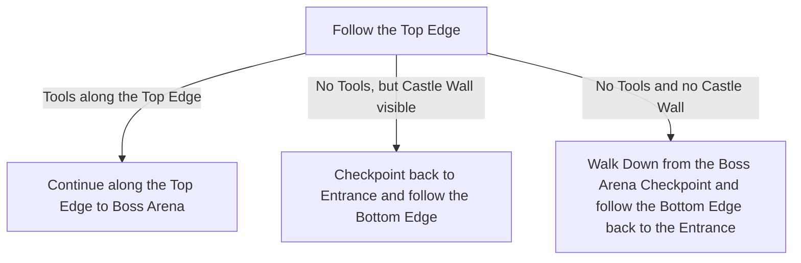

# Ogham Village

## Zone Read

:::tip Simple Read
Follow the top Edge into the direction of Manor Ramparts of Ogham Village. If you do not find the Smithing Tools, follow the bottom Edge to find it.
:::

Ogham Village is either going from Top Left(entrance) to Top Right(Exit) or Top Right(entrance) to Top Left(Exit). The Direction is based on the Overworld Position of Ogham Village to it's connected Zones.

Ogham Village also contains Renley Smith. The Smith is either along the top Edge or the Bottom Edge. If it is not at the Top Edge the position can be roughly determined based on if a Piece of Castle Wall was visible along the top Edge.

:::info Cyclon's Note
If you have a Filter with special Voicelines for Quest Items, or at least a loud Sound for the Quest Items. It is a lot easier to find Renley's Tools. (only works on Leagues where you haven't unlocked the Salvaging Bench yet)
:::

## Layouts

### Overworld Examples

| Top Left to Top Right                                                                     | Top Right to Top Left                                                                       |
| ----------------------------------------------------------------------------------------- | ------------------------------------------------------------------------------------------- |
| .png>) | .png>) |

### Variant Table

| Top Left to Top Right                                                                                                      | Top Right to Top Left                                                                                                      |
| -------------------------------------------------------------------------------------------------------------------------- | -------------------------------------------------------------------------------------------------------------------------- |
| No Tools or Walls at Top Edge, tools closer to Arena .png>) | No Tools or Walls at Top Edge, tools closer to Arena .png>) |
| Wall visible, Tools closer to Entrance .png>)               | Wall visible, Tools closer to Entrance .png>)               |
| Renley's Tools on Top Edge .png>)                           | Renley's Tools on Top Edge .png>)                           |

### Points of Interest

Smithing Tools & Blank Glyp - Unlocks Salvaging Bench
