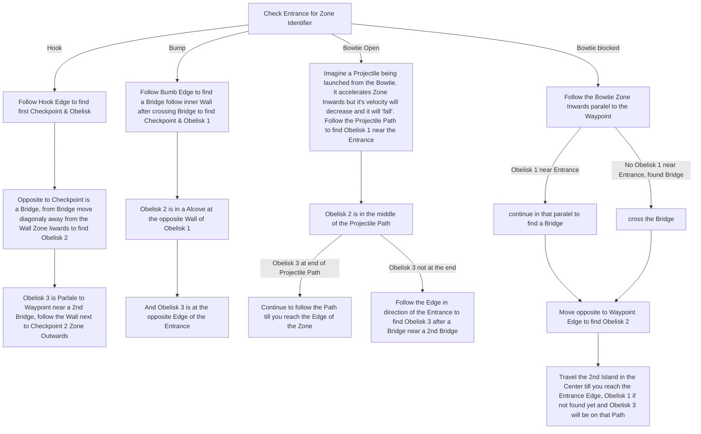
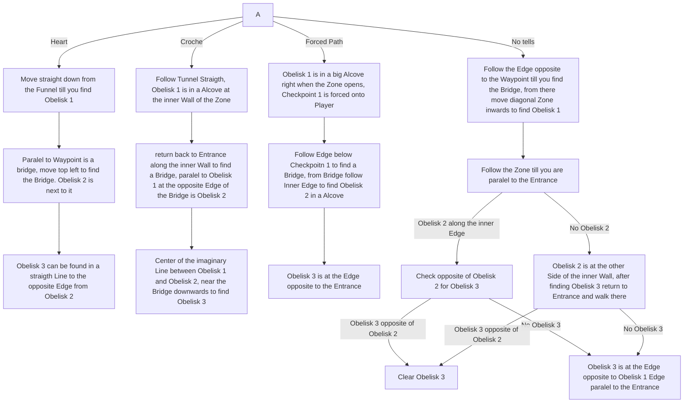

# Red Vale

## Zone Read

:::tip Simple Read
Cover the Map in a Spiral try to barely uncover the Edges of the Zone, keep an eye out for Red Veins in the Ground or Checkpoints to spot Obelisks.
:::

Red Vale has 8 Layout Variants that can be mirrored across the X or Y Axis resulting in a total of 32 Variations of the Zone.
When describing the Orientation keep in mind that the Zone can be rotated, so vague Terms have to be used.
Zone inwards means the direction to the Edge opposite the Entrance, Zone outwards means the Direction of the Edge adjacent Exit.

The 8 Variants are:

- Croche
  - Character is facing Bottom
  - WP is below starting Path
  - Tip opposite to WP looks like a Chrochehook
- Heart
  - Character is facing Bottom
  - WP is above Starting Path
  - Starting Section looks Heartlike / opens to smaller open Section then another Tunnel before Zoon actualy opens up
- Forced Path
  - Long Tunnel at Entrance before zone opens
  - Similar to Croche but has a small open Section before 2nd Tunnel
  - Checkpoint 1 is forced onto player
- Hook
  - Hook shaped Wall behind Waypoint
  - Character is facing Bottom
- Bump
  - No Forced Path & No Hook
  - Character is facing Bottom
  - Bump in the Wall opposite of Waypoint
- Vertical Bowtie or Bowtie open
  - Wall Opposite checkpoint is Bow-Tie / W Shaped
  - Character facing Bottom
  - Zone behind Checkpoint is open
- Bowtie blocked
  - Wall Opposite checkpoint is Bow-Tie Shaped
  - Character facing Bottom
  - Wall behind Checkpoint
- No Tells
  - Facing Bottom
  - No Key Tells

:::info Cyclon's Notes
I highly recommend comparing the written Instructions of the Flowchart with the visual Instructions of the Layout Examples! They make a lot more sense visualised.  
This is the 2nd best Zone to learn in Act 1. It is a complicated Zone with many variations, but the difference in time spend in Red Vale is insane between learned and not.
:::

For better readability I have split the Graph in 2. Recommended to Zoom in with 'Ctrl+ Mousewheel Up'

## Layouts

### Variant Table

| Big Props for the initial Research to tobethebest      | And to Crimson for his Visualisation and Naming for some of the Layouts |
| ------------------------------------------------------ | ----------------------------------------------------------------------- |
| .png>) | .png>)                  |
| .png>) | .png>)                  |
| .png>) | .png>)                  |
| .png>) | .png>)                  |

### Points of Interest

3 Obelisks scattered around the Zone
