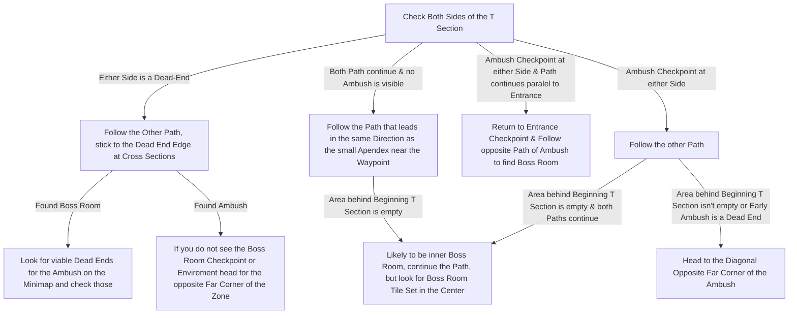

# Tomb of the Consort

## Zone Read

:::tip Simple Read
Follow the Edge of the tiny Alcove at Spawn, about 80% accurate to find the Boss Room.
:::

Tomb of the Consort has many Variants, but they can be sorted into 4 Categories.

- Dead End
- Early Ambush
- Reverse
- No Indicator

There are also the Inner Boss room Variants which are a Subcategorie of either Early Ambush or no Indicator Categories.

Tomb of the Consort has very linear smooth Walls, this Pattern is only broken for the two Point of Interest. This is even more visible when having Landscape Transparency not on 0.

Due to many different Variants the Flowchart is a bit convoluted, consider Zooming in with 'CTRL + Mouse Wheel Forward' to 200%

## Layouts

### Variant Table

| Dead End Examples                                                                                | Early Ambush Examples                                                                           | Reverse Examples                                                                                | No Indicator Examples                                                                           | Inner Boss Room Examples                                                                          |
| ------------------------------------------------------------------------------------------------ | ----------------------------------------------------------------------------------------------- | ----------------------------------------------------------------------------------------------- | ----------------------------------------------------------------------------------------------- | ------------------------------------------------------------------------------------------------- |
| .png>)  | .png>) | .png>) | .png>) | .png>)  |
| .png>)  | .png>) |                                                                                                 | .png>) | .png>) |
| .png>) |                                                                                                 |                                                                                                 | .png>) |

### Points of Interest

Embattled Trove - Ambush by Death Knight - Drops LvL 1 Support Gem  
Asinia - Drops Key Piece for Main Quest Progression
