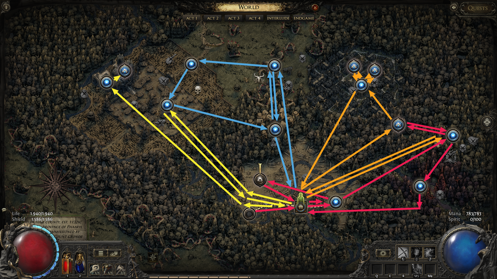
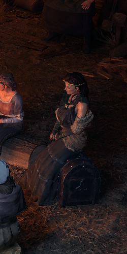
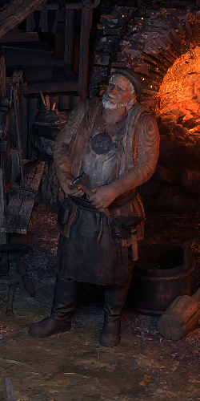
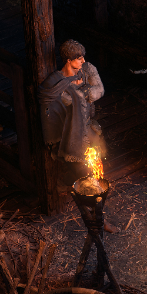
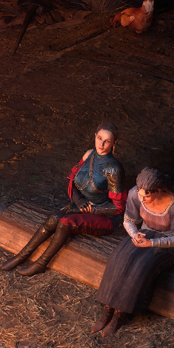

# Overview

## Video Guide

SoonTM

## Progression

Act 1 includes a lot of Zone Changes and many Town Visits, each Color indicated one Section of Act 1:  
The  red Arrows are from Nr. 1 to Nr. 17 for the Hooded One Section.  
The  orange Arrows are from Nr. 18 to Nr. 28 for the Graveyard Section.  
The  blue Arrows are from Nr. 29 to Nr. 38 for the Travel Section.  
The  yellow Arrows are from Nr. 39 to Nr. 45 for the Ogham Section.

White / Black Text is required for Main Story Progression or Permanent Buffs.  
 Red Text marks Optional Tasks for additional Uncut Skill Gems or Uncut Support Gems, the Notes include the Reward.

Several Tasks in one Area can be completed in any Order, unless otherwise noted.

| Nr. | Zone                     | To-Do                                                                                 | Notes                                                                                                                                     |
| --- | ------------------------ | ------------------------------------------------------------------------------------- | ----------------------------------------------------------------------------------------------------------------------------------------- |
| 1   | Riverbank                | Kill the bloated Miller                                                               | Ignore all other Monsters in this Zone, The Miller is a guranteed Level Up                                                                |
| 2   | 1st Town Visit           | LvL 1 Uncut Skill Gem                                                                 | Get your first Uncut Gem from talking to Renley and accepting the Quest                                                                   |
| 3   | Clearfell                |  Open Chest in Mysterious Campsite                  | 2nd LvL 1 Uncut Skill Gem                                                                                                                 |
| 4   | Clearfell                | Kill Beira of the Rotten Pack                                                         | +10% Cold Resistance Perm. Buff                                                                                                           |
| 5   | Clearfell                |  Enter Mud Borrow                                   |                                                                                                                                           |
| 6   | Mud Burrow               |  Kill the Devourer                                  | Drops LvL 2 Uncut Skill Gem and Reward from Renly LvL 1 Uncut Support Gem                                                                 |
| 7   | Clearfell                | Enter Grelwood                                                                        |                                                                                                                                           |
| 8   | Grelwood                 | Find the Witch Hut, open the Chest and kill the Witch                                 | The Witch is a Rare Monster with 2 Random Modifiers, Reward is LvL 1 Uncut Support Gem and Chest contains Medium Life + Mana Flask        |
| 9   | Grelwood                 | Activate the Waypoint                                                                 |                                                                                                                                           |
| 10  | Grelwood                 | Enter Grim Tangle                                                                     |                                                                                                                                           |
| 11  | Grim Tangle              | Activate Waypoint then return to Grelwood                                             |                                                                                                                                           |
| 12  | Grelwood                 | Enter Red Vale                                                                        |                                                                                                                                           |
| 13  | Red Vale                 | Find and activate the 3 Obelisk of Rust                                               |                                                                                                                                           |
| 14  | Red Vale                 | Kill the Rust King                                                                    | Drops LvL 3 Uncut Skill Gem                                                                                                               |
| 15  | 2nd Town Visit           | Get Runed Spikes from Renly                                                           |                                                                                                                                           |
| 16  | Grelwood                 | Use Runed Spikes on Tree of Souls                                                     | You can immediately leave after placing the 3rd Spike                                                                                     |
| 17  | 3rd Town Visit           | Talk to Una and WP to Grim Tangle                                                     |                                                                                                                                           |
| 18  | Grim Tangle              | Summon and talk to Una                                                                | You can skip the Song Animation by using 'Respawn at Checkpoint'                                                                          |
| 19  | Grim Tangle              |  Kill Ervig, the rotten Druid                       | Drops LvL 1 Uncut Support Gem                                                                                                             |
| 20  | Grim Tangle              | Enter Cemetery of the Eternals and activate Waypoint                                  |                                                                                                                                           |
| 21  | Cemetery of the Eternals |  Open Sarcophagus in Ancient Ruin                   | Normal Lazuli or Iron Ring                                                                                                                |
| 22  | Cemetery of the Eternals | Activate Checkpoint at Tomb of Consort                                                | It is recommended to find both Entrances first                                                                                            |
| 23  | Cemetery of the Eternals | Activate Checkpoint at Mausoleum of the Praetor                                       |                                                                                                                                           |
| 24  | Tomb of the Consort      |  Open Haunted Treasure and kill Rare Eternal Knight | Drops LvL 1 Uncut Support Gem                                                                                                             |
| 25  | Tomb of the Consort      | Kill Asinia, the Praetor's Consort                                                    | After killing Asinia, a Portal to the Entrance of the Tomb opens                                                                          |
| 26  | Mausoleum of the Praetor | Kill Draven, the eternal Praetor                                                      | After killing Draven, a Portal to the Entrance of the Mausoleum opens                                                                     |
| 27  | Cemetery of the Eternals | Kill Lachlann of Endless Lament                                                       | You can skip the Dialog by using 'Respawn at Checkpoint after opening the Gate.  Pick up Lachlanns Ring |
| 28  | 4th Town Visit           |  Bring Lachlann's Ring to Una to unlock Hooded One  | This is only recommended if you need to identify several Items or Respec during Act 1                                                     |
| 29  | Hunting Grounds          |  Kill the Rare Monster from the Dryadic Ritual      | Drops LvL 1 Uncut Support Gem                                                                                                             |
| 30  | Hunting Grounds          | Kill Crowbell                                                                         | +2 Weapon Set & Passive Points                                                                                                            |
| 31  | Hunting Grounds          | Enter Freythorn                                                                       |                                                                                                                                           |
| 32  | Freythorn                | Activate Waypoint and WP to Hunting Grounds                                           | Using the WP is faster than walking back                                                                                                  |
| 33  | Hunting Grounds          | Enter Ogham Farmlands                                                                 |                                                                                                                                           |
| 34  | Ogham Farmlands          | Find and get Una's Lute                                                               |                                                                                                                                           |
| 35  | Ogham Farmlands          | Enter Ogham Village                                                                   |                                                                                                                                           |
| 36  | Oghma Village            | Activate Waypoint and WP to Freythorn                                                 |                                                                                                                                           |
| 37  | Freythorn                | Find and activate the 4 Rituals, then Kill the King in the Mist                       | +30 Spirit and LvL 4 Uncut Spirit Gem                                                                                                     |
| 38  | 5th Town Visit           | WP to Ogham Village                                                                   | +2 Weapon Set & Pasive Points from Una for handing in her Lute                                                                            |
| 39  | Ogham Village            | Find Renley's Tools and Blank Rune                                                    |                                                                                                                                           |
| 40  | Oghma Village            | Kill the Executioner and free + talk to Leitis                                        |                                                                                                                                           |
| 41  | 6th Town Visit           | LvL 5 Uncut Skill Gem and unlock Salvage Bench                                        | Leitis Rewards LvL 5 Uncut Skill Gem, Renley unlocks Salvage Bench and rewards Artificer's Orb + Lesser Rune of Choice                    |
| 42  | Manor Ramparts           |  Activate the Gallows                               | Drops LvL 1 Uncut Support Gem                                                                                                             |
| 43  | Manor Ramparts           | Enter Ogham Manor                                                                     |                                                                                                                                           |
| 44  | Ogham Manor              | Kill Count Geonor                                                                     | During Death Dialog use the Elevator and go back to Checkpoint                                                                            |
| 45  | Ogham Manor              | Kill Candlemass, the living Rite                                                      | +20 Max Life, It is faster to kill Candlemass 2nd, during Geonor death Dialog, BUT IF YOU DIE during Fight Geonor Loot disappears.        |
| 46  | 7th Town Visit           | Talk to the Hooded One to travel to Act 2                                             |                                                                                                                                           |

## League Mechanic Rewards

Started with Abyss the current League Mechanic gave guranteed Rewards when doing the in-zone Mechanic. These Rewards are only guranteed once and help smooth out the Campaign Progression a lot.

So in Fate of the Vaal, the Vaal Charge Platforms dropped these when clearing all Monsters, or in Abyss these Rewards were guranteed when the Last Abyss spawned a Chest. This is not a gurantee going forward, but it is good to know.

Recommended ones are great to collect if they are on teh way, force ones ae really good to spend some extra time in the zone to find.

| Zone                     | Reward               | Notes              |
| ------------------------ | -------------------- | ------------------ |
| Clearfell                | Orb of Transmutation | Recommended, Force |
| Mud Burrow               | Orb of Augmentation  | Recommended        |
| Grelwood                 | Orb of Transmutation |                    |
| Red Vale                 | LvL 2 Skill Gem      |                    |
| Grim Tangle              | LvL 3 Skill Gem      | Recommended        |
| Cemetery of the Eternals | Regal Orb            | Recommended, Force |
| Tomb of the Consort      | Amulet               | Recommended        |
| Mausoleum of the Praetor | Random Lesser Rune   |                    |
| Hunting Grounds          | Exalted Orb          | Recommended        |
| Ogham Farmlands          | LvL 4 Skill Gem      |                    |
| Freythorn                | LvL 1 Support Gem    | Recommended        |
| Ogham Village            | Artificer's Orb      | Recommended        |
| Manor RAmparts           | LvL 5 Skill Gem      | Recommended, Force |
| Ogham Manor              | Orb of Alchemy       | Recommended, Force |

## Town NPCs

| Una                                                | Renly                                    | Finn                                   | Hooded One                                                                  | Leitis                                            |
| -------------------------------------------------- | ---------------------------------------- | -------------------------------------- | --------------------------------------------------------------------------- | ------------------------------------------------- |
|                |  |  |                       |         |
| Una sells Wands,Sceptres,Foci, Jewellery & Flasks. | Renly sells Armour & Weapons.            | Finn offers Gambling.                  | The Hooded One allows Respecilisation and Identifies Items                  | Quest Reward upon unlocking                       |
|                                                    |                                          |                                        | Unlocks after bringing Count Lachlann's Ring to Una OR killing Count Geonor | Umlocks after killing Execuitoner and freeing her |
