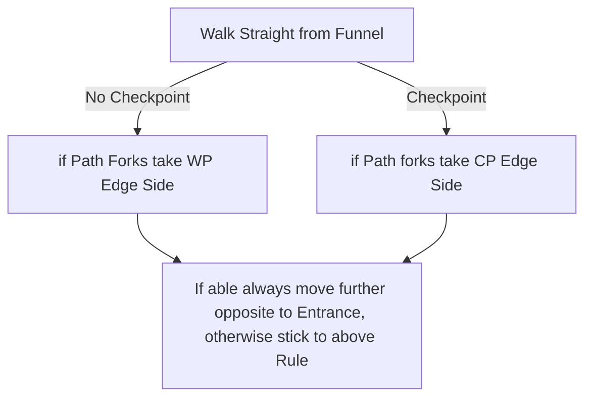

# Bone Pits

## Zone Read

:::tip Simple Read
Walk straigth Opposite from Entrance through the Funnel, then stick to CP Edge and always go in that direction if you can.
:::

Bone Pits has 4 Layout Variants and a fairly Simple Read. The Boss Arena is always opposite to the Entrance Edge. Depending on the Layout Variant it is better to stick to the Waypoint Edge or the Checkpoint Edge when searching for the Boss Room.

General Rule of Thumb is walk straigth till you reach the 'Bone Pit'. The inner Edge of the Zone that is a Pit filled with Bones. Well visible on the Minimap. From there walk around it and continue to the Far most opposite Point to Entrance to find the Boss Arena.

The Entrance of the Zone is always a Crecent Shape containing a Waypoint and a Checkpoint, then a small Funnel adorned with Banners and a massive Mastodon Skull with Tusks. Whichever Edge from the Funnel the Checkpoint is closer is the CP Edge and whichever Edge the Waypoint is closer is the WP Edge.

Depending if a Checkpoint is close or directly paralel to the Entrace at the Bone Pit we can determine the Layout Read from there.

The Boss Arena Tile is roughly paralel to the Entrance. In some Variants bit further off.

The Sun Clan Relic can drop of any Hyena Type Enemy, including the Hyena Centaurs.

## Layouts

### Variant Table

|                                                           |                                                                                                  |
| --------------------------------------------------------- | ------------------------------------------------------------------------------------------------ |
| .png>)   | No Checkpoint at Bone Pits Middle Mark .png>) |
| .png>) | Off Center Boss Arena .png>)                  |

### Point of Interest

Sun Clan Relic - Drops of Hyena Enemies
