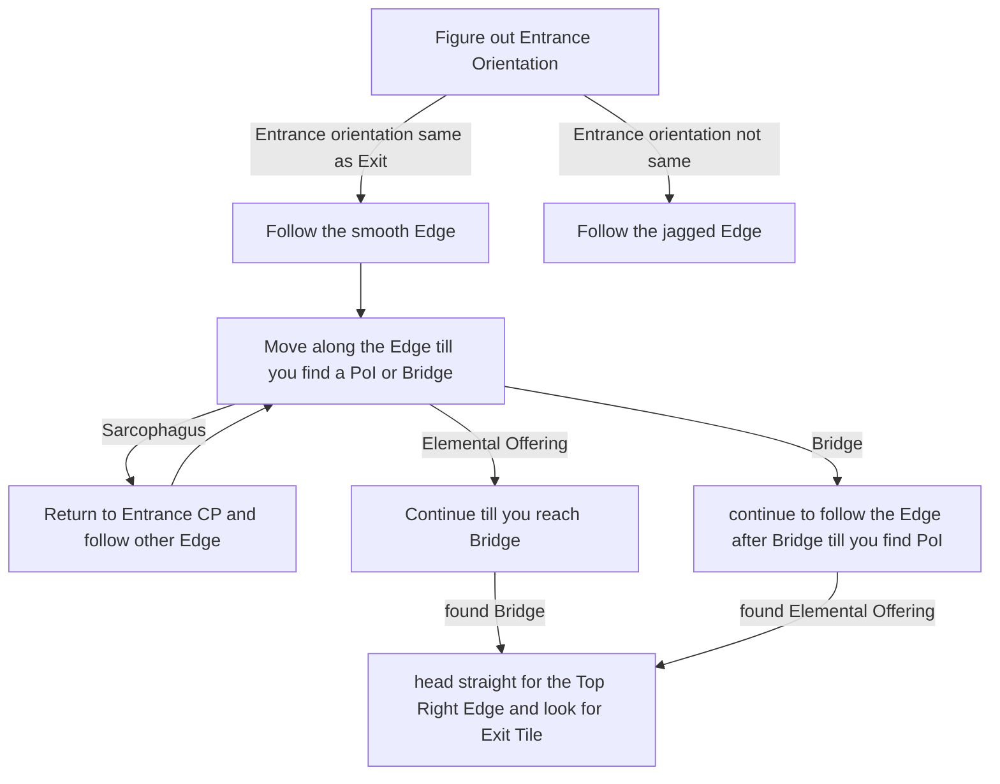

# Buried Shrine

## Zone Read

:::tip Simple Read
If Entrance Room tilts right follow the Smooth Edge  
If Entrance Room tilts left follow the Jagged Edge
:::

Buried Shrine has 2 Layout Sets that can be generated based on World Seed. The Key Identifier is the Starting Room orientation.

- Entrance Room tilting Right or Entrance Orientation is 90° shifted to Exit Orientation
- Entrance Room tilting Left or Entrance Orientation is same as Exit Orientation

Based on that orientation we follow a different Edge leading out of the Entrance Room Tile. Each Layout Set contains 4 Layout Variants which varieng Position of the Point of Interests. It is to be noted that the Point of Interest location can be swapped. So if the Pathing doesn't lead to the expected Point of Interest, simply follow the Pathing to the other PoI.

Similar to Lost City, Buried Shrine is 2 Maze-like Room & Hallway Sections connected by 2 paralel Bridges. The Point of Interest can appear on either Side, but this time there is a optimized Pathing that will always go past 1 Point of Interest. Usualy the Elemental Offering, but the Point of Interest can be swapped within the same Layout. In which case we just go and follow the other Edge. A alternative to the simplified Pathing I use below, you can also learn all Layout Variants and their respective PoI possitions. The Campaign Codex Discord contains all Layout Variants.

The Exit to the Heart of Keth with the Azarian Boss Fight is always along the Top Right Edge of the Zone. This Tile is quite big and looks kinda like a Portrait of a Person. It can easily be identified if you learn the Wall Shape of the Exit Tile for the Transition Rooms.

The Elemental Offering Room is always adjacent to a wide L-Piece Hallway. Depending on the Orientation it can also look like a (inverted) Heart.

The Guarded Sarcophagus is either a big open Room that is mirrored along the Y-Axis, kinda looks like a Butterfly. Or is a long Alcove with several Layers of Stairs. Either can be generated for each Layout Variant.

Do note that the Pathing tries to always find Elemental Offering, but skips the Sarcophagus.

## Layouts

### Variant Table Examples

| Right Tilted Entrance                                                                                               | Left Tilted Entrance                                                                                               |
| ------------------------------------------------------------------------------------------------------------------- | ------------------------------------------------------------------------------------------------------------------ |
| Shorter Path if Layout is identified early .png>) | E.O. before Bridge, PoI cannot be swapped .png>) |
| .png>)                                            | E.O. before Bridge, PoI cannot be swapped.png>)  |
| PoI swapped .png>)                                | E.O. after Bridge, PoI can be swapped .png>)     |

### Points of Interest

Guarded Sarcophagus - Drops LvL 2 Support Gem
Elemental Offering - Drops Element related Magic Ring
Heart of Keth - Killing Azarian and doing the 'RPG' drops Main Quest Item.
