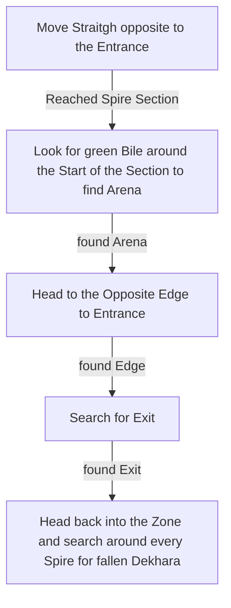

# Spires of Deshar

## Zone Read

:::tip Simple Read
Exit along the opposite Edge of Entrance, walk in straight Line, then check along the opposite Edge.
:::

Deshar is a fairly Simple Zone that is technically solved, with one Exception. The Position of the fallen Dekhara is completly random and not defined by the Layout Variant.

The Layout is split into two Sections, the Sand Passage Section and the Spire Section. The Sandpassage Section contains a Forgotten Corpse PoI which drops 1 Artificer Orb. There will always be a more or less linear path through the firs Section to the second Section. The Corpse can be along either Edge of the first Section with no clear indicator.

The Second Section contains the two other Point of Interest.

- The Watchfull Twin Miniboss Encounter, 2 Vulture Rare Enemies with semi Random Modifiers. The drop a Level 28 Djinn Barya. The arena is indicated by green bile on the ground and is always at the start of the Spire Section.
- The fallen Dekhara, which can be adjacent to **any** Spire with no clear Indicator as to which.

:::info Cyclon's Note
While not been able to recreate I had a Variant where the fallen Dekhara was in the far corner of the Map next to no Spire.
:::

The Exit is always at the opposite Edge of the Entrance, usually to the Right Side of the Zone. The Opposite Edge is indicated by non Spire Buildings either forming a Line or being part of the Zone Edge. The Exit Building is the only Building with lit braziers.

## Layouts

### Variant Table

|                                            |
| ------------------------------------------ | -------------------------------------------- |
| .png>) | .png>) |

### Points of Interest

Watchfull Twins - 2 Rare Vulture Miniboss Fight with semi random Mods, drops Djinn Barya
Forgotten corpse - Drops Artificer Orb
Fallen Dekhara - Drops Final Letter, can be handed to Shambrin for +2 Weapon Set & Passive Points
