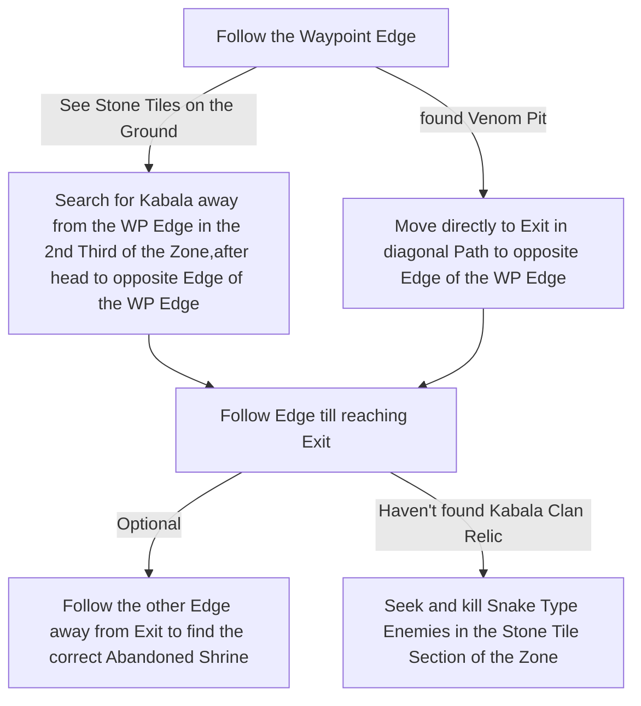

# Keth

## Zone Read

:::tip Simple Read
Follow the WP Edge till you reach the Exit, then go back and search the Middle Section for the Boss
:::

The Exit to Lost City is always diagonal opposite to the Entrance and WP. The Top Corner of the Zone not containing the Waypoint has no Point of Interests!

Kabala's Venom Pit is always in the 2nd Third of the Zone, BEFORE the Sand Ground gets replaced by Stone Tiles. The Venom Pit is also always adjacent to a Wall Section with raised Ground and a Sand Roof in a V-Shape.

The Snake / Lamia Type Enemies have a Chance to drop the Kabala's Clan Relic, they spawn in the 3rd Third of the Map on Stone Tile Ground.

The only other Wall Tile with raised Ground is the correct Reward Room Entrance next to a Building in the 3rd Section of the Zone. The fake Room is always a Hole in the Ground in the 2nd Section.

## Layouts

### Variant Table

| WP at Right Edge, Boss on Path         | WP at Right Edge, Boss not on Path     | WP at Left Edge, Boss on Path          |
| -------------------------------------- | -------------------------------------- | -------------------------------------- |
| .png>) | .png>) | .png>) |

### Points of Interest

Abandoned Shrine - Blue Pack & Rare Chest with Amulet
Venom Pit - Kill Kabala for +2 Weapon Set & Passive Point
Kabala Clan Relic - Drops of Snake Type Enemies in the 3rd Section of the Zone
