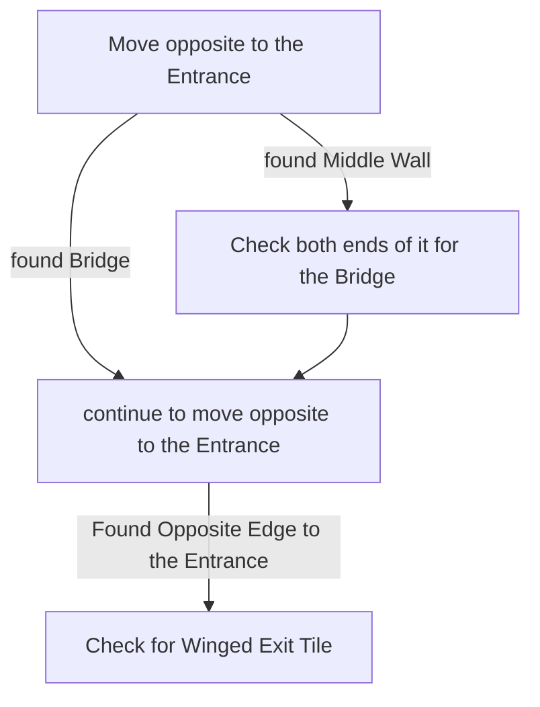

# Lost City

## Zone Read

:::tip Simple Read
Follow either outer Edge till you reach the Exit
:::

Lost City consists of 2 maze-like Sections made of diffrent Rooms and Hallways connected by a Bridge. The Room Tile connected to the Bridge is formed like a Funnel or Shield.

The Exit Tile is formed Like a Winged Bident and is always at the Edge opposite to the Entrance, it will always have a straigth Entrance from the maze Section.

The 2 Point of Interest, the Golden Tomb and Gallery, can be found in either Maze Section of the Zone and have no clear indicator as to where. However the rooms have a easily identifiable Tile.

- The Golden Tomb is always in the middle of a Big open Room with 4 winged Ends, similar to Exit Tile, forming a Cross.
- The Gallery is the only Room with clearly uneven Walls.

Parallel to the Entrance at the Middle Point of the Map is a broken Bridge, indicating the Middle Wall of the Zone. To either End is a Diagonal Bridge connecting the 2 Maze Sections. If you have Landscape Transparency not set to 0, you can also identify the Middle Wall from the Landscape near it.

## Layouts

### Variant Table

| Bottom Left to Top Right                                  | Top Left to Bottom Right                                  |
| --------------------------------------------------------- | --------------------------------------------------------- |
| .png>) | .png>) |

### Points of Interest

Gallery - 7th Treasure of Keth Rare Gilded Beetle Enemy drops random Jewel
Golden Tomb - LvL 6 Spirit Gem
