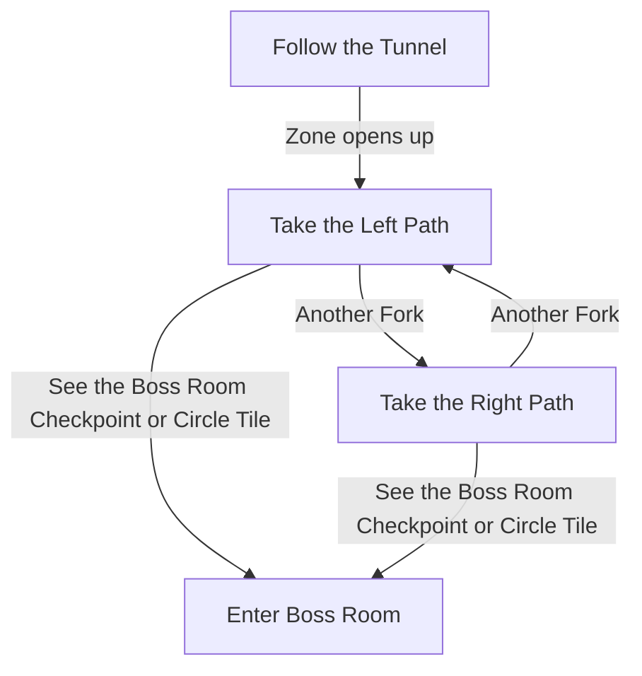

# Mawdun Mine

## Zone Read

:::tip Simple Read
The Boss Room is diagonall Opposite to the Entrance Tunnel Section. Always move in that direction if you can.
:::

Mawdun Mine is a Diamond shaped Zone. You spawn in one Corner of the Diamond and the Boss Room is in the opposite Corner. The Spawn is not always directly in the Corner but connected to a Tunnel System before opening up. The Spawn Area and Initial tunnel system make up the Corner of the Zone. A Checkpoint is at the end of the initial Tunnel Area.

Left of the Boss Room Checkpoint is always a Circle Section with Light shining through ona pile of Wagon Rubble. It is slightly easier to find the Boss Room when sticking to the Let Side of the Middle Section of the Zone whenever coming to a Fork as the Circle Tile is easy to identify.

The Area contains a currently unused Landmark Checkpoint, which is assumed to be the Accesspoint for a future Leauge Mechanic.

## Layouts

### Variant Table

|                                                               |
| ------------------------------------------------------------- |
| .png>) |

### Points of Interest

Munition Bunker - Killing Rutja unlocks Risu as a Town NPC (Gambling & required for Main Quest Progression)
