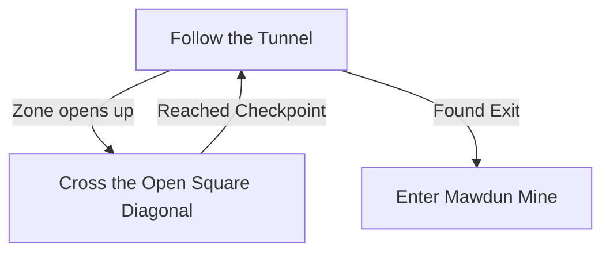

# Mawdun Quarry

## Zone Read

:::tip Simple Read
Follow the Path during the Tunnel Sections and cross the Open Sections Diagonal. The Checkpoints are at the Entrance to the next Tunnel Sections
:::

Mawdun Quarry consist of a Series of Tunnel Sections connecting 2 open Sections. The open Areas are roughly squares. The Exit to the next Tunnel Section is marked by a Checkpoint. When entering a open Area, look where the two Walls are and walk Diagonal into the opposite Corner.

When a tunnel Section forks, imagine the Entire Zone being in a Big squared Diamond. Move into the direction of the Diamond you haven't discovered yet.

The Farridun Cache can be adjacent to any Open Area or Tunel Section. There is not a consistent Way to find it.

## Layouts

### Variant Table

|                                                                     |
| ------------------------------------------------------------------- |
| .png>) |

### Points of Interest

Farridun Cache - Drops an Artificer Orb
