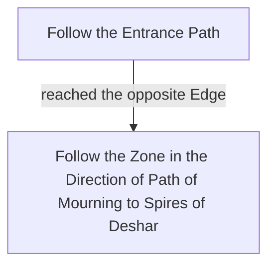

# Path of Mourning

## Zone Read

:::tip Simple Read
Follow the Zone in the Direction of the Entrance Path. When reaching the opposite Edge, turn 90° and head into the opposite Corner of the Entrance.
:::

Path of Mourning is roughly in a triangle Shape with the Entrance and Exit forming the 2 Corners of the Long Edge. They are roughly paralel to each other. The Zone follows the Direction of the Overworld Position between Deshar & Path of Mourning and Path of Mourning and Spires of Deshar.

The Entrance direction will always mirror the first. And the Zone will later turn to mirror the later.

In the Middle of the zone is a Point of Interest with a couple of Rare Pots and a Miniboss dropping a LvL 8 Skill Gem. The PoI is always on a halfcircle Platform, but there is no clear indicator to identify the position. The Zone Pathing ususaly run past it.

## Layouts

### Overworld Examples

|                                                                                  |                                                                                  |
| -------------------------------------------------------------------------------- | -------------------------------------------------------------------------------- |
| .png>) | .png>) |

### Variant Table

|                                                                                    |                                                                                    |                                                                                    |
| ---------------------------------------------------------------------------------- | ---------------------------------------------------------------------------------- | ---------------------------------------------------------------------------------- |
| .png>) | .png>) | .png>) |

### Points of Interest

Shifting Vases - Rare Pots and Rare Urnwalker Miniboss drops LvL 8 Skill Gem
