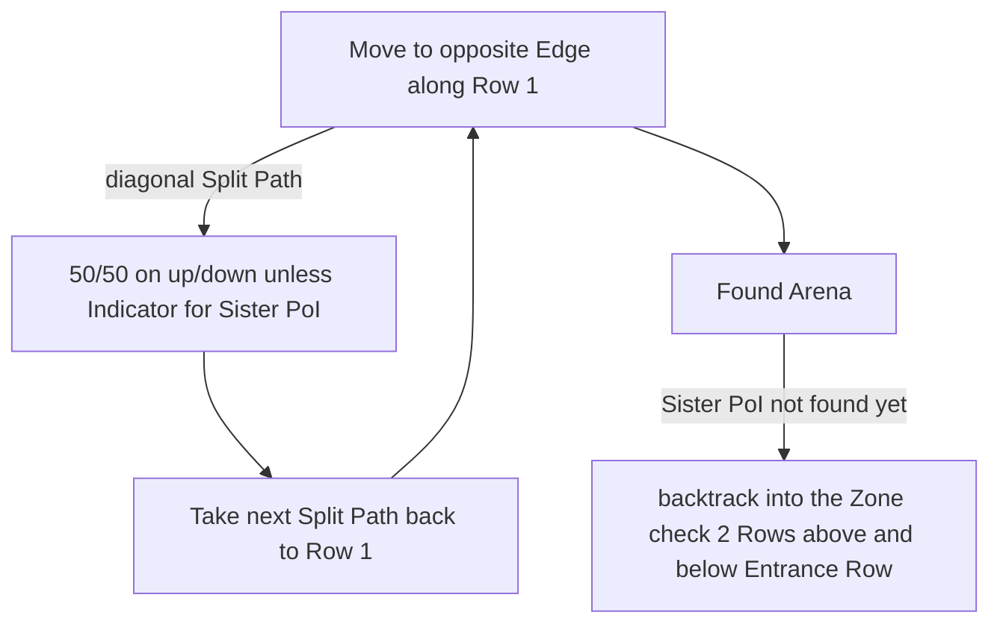

# Spires of Deshar

## Zone Read

:::tip Simple Read
Entrance and Boss Arena Entrance are horizontal paralel to each other.
:::

Spire of Deshar is a Grid made up of Towers connected by Bridges. The Grid consist of 7 Rows and 12 Columns. A tower Tile can be small or large.

The Boss Arena Entrance is always on Row 1 and the Arena is in Row 2 diagonal Top of the Entrance.

Any Large Tower tile can be the Sisters of Garukhan Point of Interest. However the Sisters of Garukhan follow a subset of rules. [Big Props to fireMCG from the Campaign Codex Discord for discovering the Ruleset of the Zone]

- It cannot spawn on the outline of the Grid
- It can only spawn on even numbered Columns and odd numbered Rows (Entrance & Boss Arena Entrance Row is Row 1)
- The Entrance Tile is 2 Columns wide and blocks the Sisters PoI on Column 2.
- The PoI consists of 1 Large Tower + 4 adjacent Small Towers to the 4 cardinal Directions. The Top and Left & Bottom Tower are diagonally connected and the Bottom and Right Tower connect to the Center Tower. Forming a G Shape
- The small Towers can only be diagonally connected outside of the Center Tower
- The PoI can be in the lower or upper half of the Zone

Given this Ruleset for the PoI and the Boss Arena the optimal Way to run the Zone is as follows:

## Layouts

### Variant Table

| Example                                                                          | Example 2                                                                          |
| -------------------------------------------------------------------------------- | ---------------------------------------------------------------------------------- |
| .png>) | .png>) |
