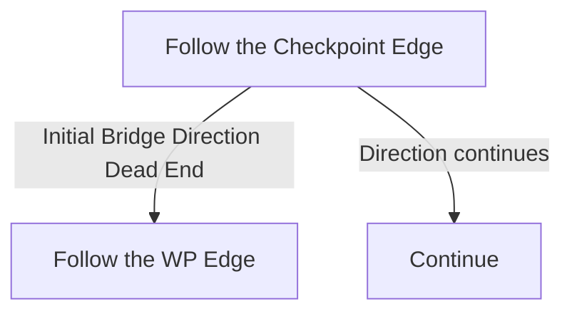

# Titan Grotto

## Zone Read

:::tip Simple Read
Follow the Checkpoint Edge
:::

Titan Grotto is a long Rectangle Zone where you spawn in one corner and the Boss Arena is at the opposite Edge. In 3 of the 8 Layout Variants the Entrance and Boss Arena are along the same Edge. On all other Layouts the Arena is in the opposite Corner.

The Zone also contains a Titan's Sword which drops a random Lesser Rune, there is not a known Way to know its position.

At the Middlemark of the Zone 2 Bridges will have a Checkpoint and a Set of downward Stairs. The Bridges are along the Long Edge of the Zone

The zone will never do a Turn, unless you walked into a Dead End there won't be a need to walk towards the Entrance.

## Layouts

### Variant Table Examples

| Same Edge                                                        | Diagonal Opposite                                                  |
| ---------------------------------------------------------------- | ------------------------------------------------------------------ |
| .png>) | .png>) |

### Points of Interest

Titan's Sword - Drops a Lesser Rune  
Dias of Reconing - Zalmarath drops Essence of Fire (Main Quest Item)  
2 Bridges along the Long Edge of the Zone
