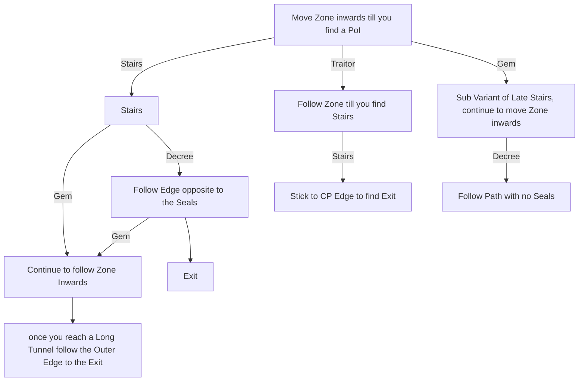

# Traitor's Passage

## Zone Read

:::tip Simple Read
Move as far into the Zone opposite to entrance as possible. Stairs upwards are always correct Path. At Decree(In Images I named it Declaration) go opposite to Seals.
:::

Traitor's Passage has technicaly 8 Layout Variants, however 4 can be summized as "Standard". A fairly linear Path with the Big Staircase leading to the Decree and then Exit & Balbala Arena splitting of at the Decree. 3 of those 4 are fairly rare on top.

The other 4 Layouts have distinct indicators based on which Point of Interest is the first One encountered.

The Decree of Inprisoment is always before the Prison of the Disgraced, where you can fight Balbala for a Barya, which unlocks the Trial of Sekhema for your 1st Ascendancy Point.

Each Zone contains a big Quarter Circle Staircase around several Statues, this Point of Interest is called Stairs.

The last Point of Interest is a rare Bell Chest with piles of Gold and a Blue Pack next to it, it drops a LvL 6 Skill Gem and is called Gem.

The Zone extends opposite to the Entrance and only the early Traitor Variant forces a Twist in a different direction. The Zone is sepperated in several Layers connected by Stairs, including the Stairs PoI. The correct Path to the Exit will always take Stairs upwards, but never downwards.

The last Section right before the Exit is in most cases a Grid of Rooms. Following the Left Edge from the Charaters perspective when entering is usualy the shortest Path to the Exit.

:::info Cyclon's Note
Due to the difficulty & length of the Bossfight for most builds it is currently recommended to get your Barya in Deshar from the Rare Fight PoI.
:::

## Layouts

### Variant Table

|                                                                                   |                                                                                   |                                                                                   |
| --------------------------------------------------------------------------------- | --------------------------------------------------------------------------------- | --------------------------------------------------------------------------------- |
| .png>) | .png>) | .png>) |
| .png>) | .png>) |                                                                                   |

### Points of Interest

Stairs - Long Quarter-Circle Staircaise along a set of Statues  
Decree & Traitor - Lore Object & Balbala Boss Arena, Balbala drops Barya for Trial of Sekhema  
Gem - Rare Bell Chest drops LvL 6 Skill Gem, guarded by Magic Pack
