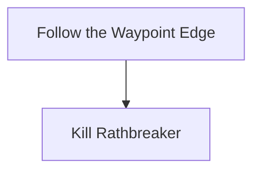

# Vastiri Outskirts

## Zone Read

:::tip Simple Read
Follow the Direction the Zone opens up along the Waypoint Edge
:::

Vastiri Outskirts has 8 Layout Variants that can be categorized in 3 Groups:

- Straight
- U-Shaped
- S-Shaped

A clear Way to read and identify the Layout Variant or Group has not been discovered yet. It is recommended to follow the Simple Read for now.

The correct Tunnel / Passage leading to Rathbreaker is always a 'handsome Macaroni' (name yoinked from [Crimson Casts](https://www.youtube.com/@CrimsonCasts)). The width at the beginning and end of the entrance curve into the Tunnel is the same distance and it is at a 90° Angle.

The Abandoned Camp will always be somewhat near the Waypoint. The Waypoint Edge will not guranteed lead to it!

## Layouts

### Variant Table Examples

| Straitgh                                                                       | U-Shaped                                                                         | S-Shaped                                                                  |
| ------------------------------------------------------------------------------ | -------------------------------------------------------------------------------- | ------------------------------------------------------------------------- |
| .png>) |             | .png>) |
|                                                                                | .png>) |

### Points of Interest

Abandoned Camp - Level 2 Support Gem
Raider's Cliff - Killing Rathbreaker unlocks Ardura Caravan
