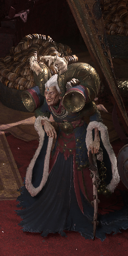
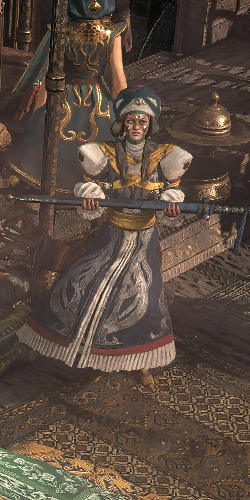
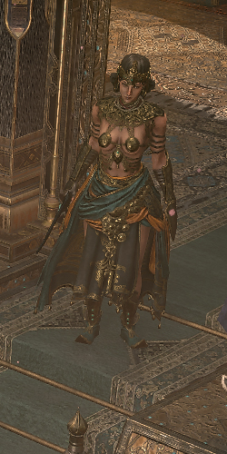

# Overview

## Video Guide

SoonTM

## Progression

Act 2 contains a Lot of Traveling with the Caravan, to not confuse with the Numbering of the Progression I opted for Letters for the Order of Travel Points we take:  
a. Vastiri Outskirts  
b. Mawdun Quarry  
c. Halani Gates  
d. Traitor's Passage  
e. Keth  
f. Mastodon Badlands  
g. Valley of Titans  
h. Deshar  
i. Dreadnought

White / Black Text is required for Main Story Progression or Permanent Buffs.  
 Red Text marks Optional Tasks for additional Uncut Skill Gems or Uncut Support Gems, the Notes include the Reward.

Several Tasks in one Area can be completed in any Order, unless otherwise noted.

| Nr. | Zone                  | To-Do                                                                                            | Notes                                                                                                                   |
| --- | --------------------- | ------------------------------------------------------------------------------------------------ | ----------------------------------------------------------------------------------------------------------------------- |
| 1   | Vastiri Outskirts     | Kill Rathbreaker                                                                                 | You can portal the moment Rathbreaker dies                                                                              |
| 2   | Vastiri Outskirts     | Talk to Zarka                                                                                    | Zarka Rewards LvL 5 Uncut Skill Gem and Unlocks Town                                                                    |
| 3   | 1st Town Visit        | Talk to the NPCs. Travel to Mawdun Quarry                                                        |                                                                                                                         |
| 4   | Mawdun Quarry         |  Open the Faridun War Cache                                    | Artificer's Orb                                                                                                         |
| 5   | Mawdun Quarry         | Enter Mawdun Mine                                                                                |                                                                                                                         |
| 6   | Mawdun Mine           | Kill Rudja, Dread Engineer and free + talk to Risu                                               | Drops LvL 6 Uncut Skill Gem                                                                                             |
| 7   | 2nd Town Visit        | Travel to Halani Gates                                                                           |                                                                                                                         |
| 8   | Halani Gates          | Trigger Quest State                                                                              | To Trigger the Quest State walk towards Asala                                                                           |
| 9   | 3rd Town Visit        | Talk to Risu, then Asala. Travel to Traitor's Passage                                            |                                                                                                                         |
| 10  | Traitor's Passage     | Kill Balbala, the Traitor and collect Barya                                                      | Drops LvL 6 Uncut Skill Gem                                                                                             |
| 11  | Traitor's Passage     | Enter Halani Gates                                                                               |                                                                                                                         |
| 12  | Halani Gates          | Complete the Jamanra fight. Trigger Quest State                                                  | To Trigger, walk towards the Sand Wall                                                                                  |
| 13  | 4th Town Visit        | Talk to Zarka. Travel to Keth                                                                    | Zarka Rewards a LvL 2 Uncut Support Gem                                                                                 |
| 14  | Keth                  | Kill Kabala, Constrictor Queen                                                                   | +2 Weapon Set & Passive Points                                                                                          |
| 15  | Keth                  | Collect the Kabala Clan Relic (can also be dropped in Lost City)                                 | Part of a Perm. Buff, drops randomly from Snake Enemies                                                                 |
| 16  | Keth                  | Enter Lost City                                                                                  |                                                                                                                         |
| 17  | Lost City             | Open the Golden Tomb                                           | Drops Lvl 7 Uncut Spirit Gem                                                                                            |
| 18  | Lost city             | Enter Buried Shrines                                                                             |                                                                                                                         |
| 19  | Buried Shrines        | Open the Sarcophagus                                           | LvL 2 Uncut Support Gem and activates an Army of Terracotta Soldiers                                                    |
| 20  | Buried Shrines        | Find the Elemental Offering Shrine                             | Based on the Pot you get a Magic Ruby, Sapphire or Topaz Ring                                                           |
| 21  | Buried Shrines        | Kill Azarian, the forsaken Son. Talk and kill Halani, the Water Goddes. Collect Essence of Water | Azarian can be damaged even before his Boss Health Bar appears                                                          |
| 22  | 5th Town Visit        | Talk to Zarka. Travel to Trial of the Sekhemas                                                   | Zarka Rewards a LvL 2 Uncut Support Gem                                                                                 |
| 23  | Trial of the Sekhemas | Activate Waypoint. Clear the Trial                             | The Trail can be delayed till Level 26 (Highest Level to still get decent XP here)                                      |
| 24  | 6th Town Visit        | Travel to Mastodon Badlands                                                                      |                                                                                                                         |
| 25  | Mastodon Badlands     | Enter Ligthless Passage                                        | The Well of Souls might not be Part of 0.4.                                                                             |
| 26  | Lightless Passage     | Enter Well of Souls                                                                              |                                                                                                                         |
| 27  | Well of Souls         | Activate Waypoint and WP to Mastodon Badlands                                                    |                                                                                                                         |
| 28  | Mastodon Badlands     | Click the Bone Effigy at Fossilised Memorial                   | Drops a LvL 2 Uncut Support Gem                                                                                         |
| 29  | Mastodon Badlands     | Collect the Sun Clan Relic (can also be dropped in Bone Pits)                                    | Part of a Perm. Buff, drops randomly from Hyena Enemies                                                                 |
| 30  | Mastodon Badlands     | Enter Bone Pits                                                                                  |                                                                                                                         |
| 31  | Bone Pits             | Collect the Sun Clan Relic (can also be dropped in Mastodon Badlands)                            | If you have not dropped it when reaching the Boss Room, 'reset at Checkpoint and kill Hyena Type Enemies till it drops. |
| 32  | Bone Pits             | Kill Ekbab, Ancient Steed and Iktab, the Deathlord. Collect Mastodon Tusks                       |                                                                                                                         |
| 33  | 7th Town Visit        | Talk to Zarka. Travel to Valley of Titans                                                        | Zarka Rewards a LvL 2 Uncut Support Gem                                                                                 |
| 34  | Valley of Titans      | Activate Checkpoint at the Clasped Entry                                                         | Activating the Checkpoint first is faster than walking back from the 3rd Seal                                           |
| 35  | Valley of Titans      | Activate the 3 Ancient Seals                                                                     |                                                                                                                         |
| 36  | Valley of Titans      | Activate the Waypoint and place the 2 Clan Relics in the Medallion                               | +1 Charm Slot and either Charm Duration or Charges gained                                                               |
| 37  | Valley of Titans      | Enter Titan Grotto                                                                               |                                                                                                                         |
| 38  | Titan Grotto          | Activate Titan's Sword                                         | Drops a Random Lesser Rune                                                                                              |
| 39  | Titan Grotto          | Kill Zalmarath, the Colossus. Collect the Flame Ruby                                             |                                                                                                                         |
| 40  | 8th Town Visit        | Talk to Zarka and collect the Horn of the Vastiri. Travel to Halani Gates                        | Zarka Rewards a LvL 2 Uncut Support Gem                                                                                 |
| 41  | 8th Town Visit        | Activate the Horn at the front of the Ardura Caravan. Travel to Deshar                           |                                                                                                                         |
| 42  | Deshar                | Find the Fallen Dekhar. Collect Final Letter                                                     |                                                                                                                         |
| 43  | Deshar                | Interact with the Unremembered Corpse                          | Drops a Artificer's Orb                                                                                                 |
| 44  | Deshar                | Enter Path of Mounring                                                                           |                                                                                                                         |
| 45  | Path of Mourning      | Interact with the rare Urn and kill the Urnwalkers             | Drops LvL 8 Uncut Skill Gem                                                                                             |
| 46  | Path of Mourning      | Enter Spires of Deshar                                                                           |                                                                                                                         |
| 47  | Spires of Deshar      | Interact with the Sisters of Garukhan                                                            | +10% Lightning Res                                                                                                      |
| 48  | Spires of Deshar      | Kill Tor Gul, the Defiler                                                                        | Drops LvL 8 Uncut Skill Gem                                                                                             |
| 49  | 9th Town Visit        | Talk to Shambrin(Give Letter). Travel to Dreadnought                                             | +2 Weapon Set & Passive Points                                                                                          |
| 50  | Dreadnought           | Enter Dreadnought Vanguard                                                                       |
| 51  | Dreadnought Vanguard  | Kill Jamanra, the Abomination                                                                    |
| 52  | 10th Town Visit       | Talk to the Hooded One twice. Talk to Asala to Travel to Act 3                                   |

## Town NPCs

| Zarka                                              | Shambrin                                       | Risu, Faridun Defector                   | Hooded One                                                 | Sekhema Asala                            |
| -------------------------------------------------- | ---------------------------------------------- | ---------------------------------------- | ---------------------------------------------------------- | ---------------------------------------- |
|            |  |    |      |  |
| Una sells Wands,Sceptres,Foci, Jewellery & Flasks. | Shambrin sells Armour & Weapons.               | Risu offers Gambling.                    | The Hooded One allows Respecilisation and Identifies Items | Quest Progression                        |
|                                                    |                                                | Unlocks after freeing her in Mawdun Mine |                                                            |                                          |
