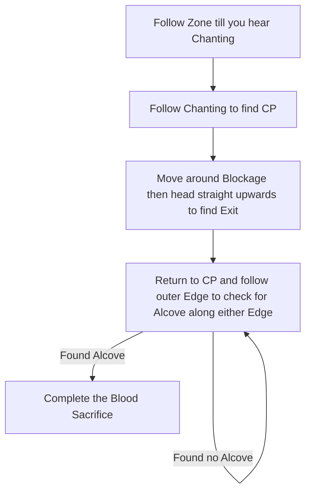

# Aggorat

## Zone Read

:::tip Simple Read
Listen to the Chanting till you reach the first Checkpoint, from there the Exit is direct opposite to the Entrance and the Blood Sacrifice to either Side.
:::

The Aggorat is the prime Version of Apex of Filth. To get to the first Checkpoint it is recommended to have audio enabled and listen to the Chanting, alternative have Audio to Text Output and keep an Eye on Chat to notice when getting close to the first Checkpoint. The Entrance Tile has always 3 Dead End and one Corner that connects into the next Section leading up to the Plaza where the Vaals are chanting Atziris Name.

After reaching the Checkpoint you can find the Blood Sacrifice along either Edge in the first Alcove. They are in a direct diagonal Line from the Chokepoint. There is no enviromental Clue as to which Side contains the PoI.

The Exit is paralel to the Checkpoint at the opposite Edge. You can walk past the initial blockage and then straight up to find the Exit.

:::info How to find the Heart
To complete the Blood Sacrifice, you have to find the Heart which drops of 1 type of Gargantuans. If you do not get the Heart randomly dropped, target farm Gargantuans in the 2nd Section of Aggorat. It contains only the type of Gargantuans that can drop the heart.
:::

## Layouts

### Variant Table Examples

| Example                                     |
| ------------------------------------------- |
| .png>) |

### Points of Interest

Blood Sacrifice - +2 Weapon Set and Passive Point
