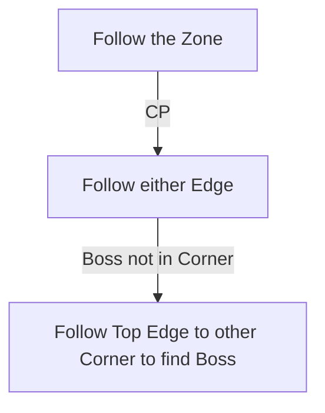

# Apex of Filth

## Zone Read

:::tip Simple Read
First two Tiles are always the same, then Zone splits into 2 Paths and Queen of Filth is in a random Corner along the opposite Edge. Follow either Edge to find the Boss.
:::

The Apex of Filth is a worn down Variant of Aggorat, follow the Zone until you find the Checkpoint. After the checkpoint the Zone opens in to a bigger Square with the Boss in either Top Corner.  
Follow either Outer Edge until reaching the Top End of the Zone and check the Corners for the Boss Fight.

## Layouts

### Variant Table Examples

| Semi-Static Zone                                              |                                                               |
| ------------------------------------------------------------- | ------------------------------------------------------------- |
| .png>) | .png>) |

### Points of Interest

Bubbling Respite - Hand in Red, Blue and Green Mushroom for a Life and Mana Flask  
Queen of Filth - Drops Golden Idol required to unlock next Zone
