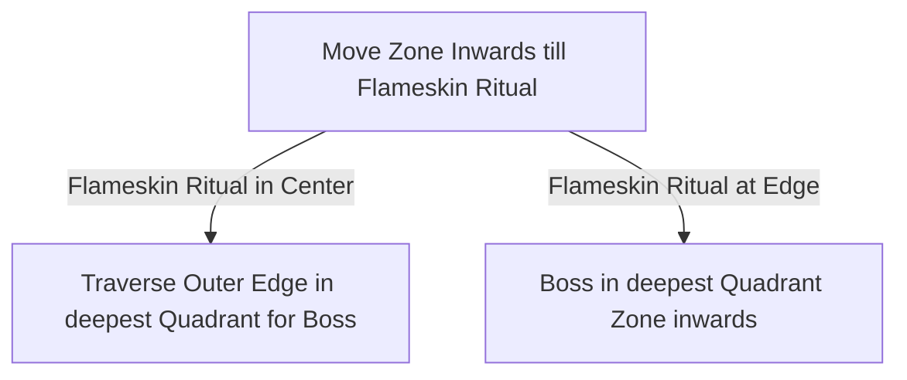

# Azak Bog

## Zone Read

:::tip Simple Read
The Ignaduk Boss Fight is always at the deepest Quadrant into the Zone, expect the Boss Arena in the furthest Corner of the Zone.
:::

The Ignaduk Boss Fight in the Azak Bog is always in the deepest Quadrant of the Zone. In most cases the Boss Arena is along the Outside Edge, however in 1 Variant the Boss Arena is facing inwards.
It is identifiable by the Flameskin Ritual being along the outer Edge of the Zone. The Burning Man is always at the Middlemark of the Map.
The best way to aproach the Zone is to move Zone inwards until you found the Flameskin Ritual or the furthest Point, then walk along the Outer Edge in the deepest Quadrant till you find the Boss Arena.

:::info Definitiv's Note
Resetting at the Checkpoint at the Flameskin Ritual is a great Source of Experience. Do not complete the Ritual, just kill the enemies and 'reset at Checkpoint'.  
We get 3-4 Packs of Enemies with decent odds of Blue or Rare Packs.
:::

## Layouts

### Variant Table Examples

| Example                                        |                                                  |
| ---------------------------------------------- | ------------------------------------------------ |
| .png>) | .png>) |

### Points of Interest

Flameskin Ritual - temporary Buff 25% Rarity and Fire Resistance  
Ignaduk - +30 Spirit and LvL 13 Spirit Gem + Ignaduk's Spear (Charm Quest Reward)
