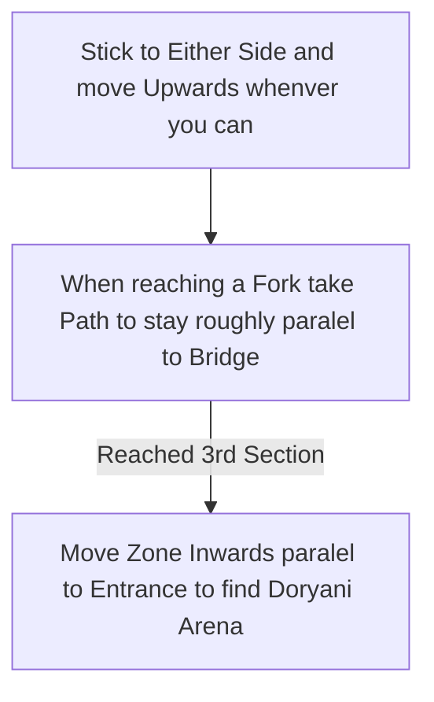

# Black Chambers

## Zone Read

:::tip Simple Read
Move towards the opposite Edge from the Entrance to find Doryani
:::

The final Zone of Act 3 is a big rectangle. There is minimal Difference between the left and right Side of the Zone. The big rectengular Zone is made up of 3 Sections connected by Bridges with a Checkpoint between the 2nd and 3rd Section.

The Sections themself are a mix of connected Rooms and Floors. There are no Point of Interest outside the Doryani Boss Fight in this Area.

## Layouts

### Variant Table Examples

| Example                                                          |
| ---------------------------------------------------------------- |
| .png>) |
