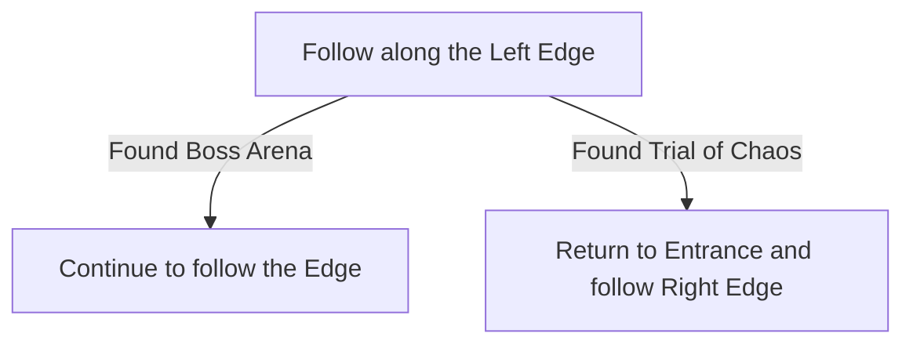

# Chimeral Wetlands

## Zone Read

:::tip Simple Read
Follow the Left Edge of the Zone till you find all Exits and PoIs
:::

Chimeral Wetlands has 40 different Layouts and no clear Enviromental Tells at the Entrance to tell which one it is.
The only rough rules for the zone we have right now are:

- If The Trial of Chaos is left of Jiquani's Machinarium on the Overworld, we expect the Machinarium Entrance to be along the Top Edge towards the right Side.
- The Trial of Chaos is always facing North
- The Boss Arena including the Checkpoint Tile infront of it is always facing Left right now due to Act 3 'static' overworld

## Layouts

### Variant Table Examples

| Boss along Left Edge                                                        | Trial of Chaos along Left Edge                                              |
| --------------------------------------------------------------------------- | --------------------------------------------------------------------------- |
| .png>) | .png>) |

### Points of Interest

Ravaged Camp - Rare Chest containing guranteed Rare Helmet  
Toxic Bloom - Rare Plant Beast drops magic Amulet  
Machinarium Entrance - Blocked till Xyclucian (Chimera) is defeated, also drops Zone LvL 40 Inscribed Ultimatum and a LvL 9 Skill Gem
