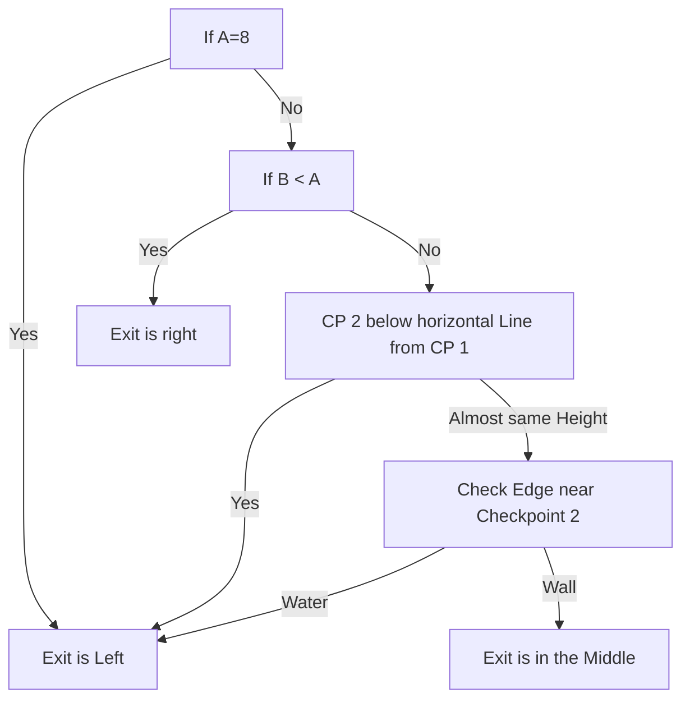

# Drowned City

## Zone Read

:::tip Simple Read
Follow the Road! Across a Bridge, then till it turns 90° to the Open Section with the Drowned Crawler Ambush. The Exit is at the End of the Road behind the Crawler Ambush. Along the Top or Right Edge.
:::

The Drowned City is a mazelike Area where the exit to both the Molten Vault and Apex of Filth are connected to the Entrance by a long Road. The exact Location of both Exits can be determined by the Alignment of the Road in the first 2 Sections of the Zone.

Major Props to the Campaign Codex Discord, specifically to Angormus & GuyThatDies for the defined Read and Crimson Cast & Drayna for the visualisation

The Units can be easily measured by the Pillars on the Minimap , each Pillar is 1 Unit Away from the next Pillar.

To figure out the Apex of Filth Exit the following Parameters are important

- A: Distance from Blockage to Canal Bridge
- B: Distance from Canal Bridge to Height of Checkpoint2
- C: Horizontal Distance between Checkpoint 1 and 2
- D: Location near Checkpoint 2 is either a dropdown to a Water Canal or a raised Wall
  

The Molten Vault Exit can be determined based on the Location of the Apex of Filth Exit.

Left-L -> Vault Right  
Left-R -> Vault Back  
Middle -> Vault Left

Right 6-3 -> Vault Back  
Right 6-5 -> Vault Left

## Layouts

### Variant Table Examples

| Example, A!=8,B>A, CP not paralel                                |
| ---------------------------------------------------------------- |
| .png>) |

### Points of Interest

Shinys - Idols selling for Gold in SideRooms across the Zone  
Ambush - Several Normal and Magic Crawlers ambush the player
