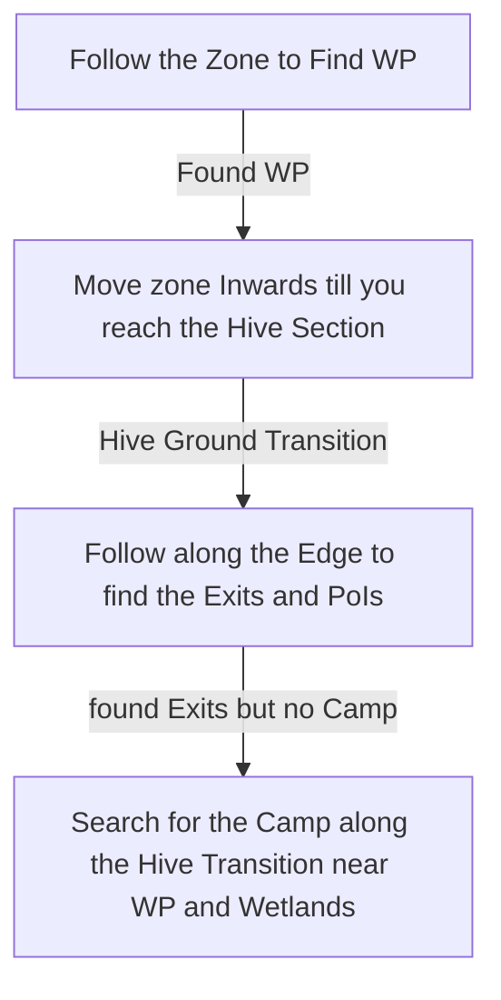

# Infested Barrens

## Zone Read

:::tip Simple Read
Follow Zone till you reach the Waypoint. From there head Zone inwards to the Hive Section of the Zone. In the Hive Section follow the Edge to find all PoIs and Exits.
:::

Infested Barrens has great Enviromental Tells to follow and identify the location of the Exits.
The Troubled Camp is always bordering both the Jungle and the Hive Section of the Map, which forces it to be either near the Waypoint at the first Jungle Section of the Map or near the Chimera Wetlands Exit.
The Ground will clearly transition from Jungle plant overgrown Terrain to barren Hive Stone Terrain.
To differentiate between the Azak Bog and the Chimeral Wetlands exit. The Azak Bog Exit is always in a small chokepoint Entrance while the Transition around Chimeral Wetland is a wide open one.

| Hive Transition                                            | Swamp Transition                                             | Jungle Transition                                              |
| ---------------------------------------------------------- | ------------------------------------------------------------ | -------------------------------------------------------------- |
|  |  |  |

## Layouts

### Variant Table Examples

| Example                                                                |                                                                          |
| ---------------------------------------------------------------------- | ------------------------------------------------------------------------ |
| .png>) | .png>) |

### Points of Interest

Larva Hollow - Rare Enemie with several Minions  
Troubled Camp - Normal 'Chest' drops guranteed Rare Boots
