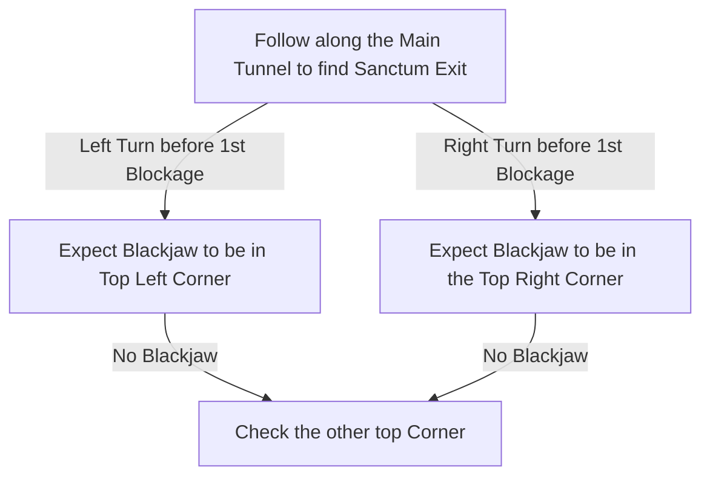

# Jiquani's Machinarium

## Zone Read

:::tip Simple Read
Follow along the Main Tunnel to find the Exit to Jiquani's Sanctum. Whenever the Path is blocked use a Movement Jump Skill to pass through the Blockage or move Paralel to the Main Tunnel.  
There are 4 Soul Cores in the 2nd Section of the Zone, you only need 2. Find them in the Maze Parts of the 2nd Section.
Blackjaw Side Arena is either in the Top Left or Top Right Corner of the Zone.
:::

To unlock the 2nd Secion find the Soul Core in either Corner of the first Section. There is no clear Tell for where it is.

Jiquani's Machinarium has a very simple Read for the Main Exit, but no clear Tell for the Blackjaw Boss Fight. To find the Exit simply follow along or paralel to the Main Tunnel.  
The Blackjaw Boss Arena is in either top Corner of the Zone. The Best Enviromental Tell, which is about 80% accurate, we have is: The Arena is in the Corner of the Last Turn of the Main Tunnel before the first Blockage.

If the Tunnel is taking a Left and then a Right Turn, we expect the Arena to be in the top Right Corner. If it is just a Left Turn, then we would expect the Arena in the Left Corner.

The Small Soul Cores are distributed across the Ruined Rooms making up the 2nd Section. There are 4 Soul Cores in Total, altough you can only use a maximum of 3. It is highly recommended to use a Loot Filter with a distinct Quest Item Drop Sound.

:::info Definitiv's Note
DO NOT RESET AT CHECKPOINT IN THIS ZONE WHiLE CARRYING A SOUL CORE! The Soul Cores are considered Local Quest Items and will drop upon Players Death or Resetting at Checkpoint. Only by placing them in their Socket will the Quest State update and Death / Reset won't reset the progression.
:::

## Layouts

### Variant Table Examples

| Left Turn before 1st Blockage                                                         | Right into Left Turn before 1st Blockage                                                |
| ------------------------------------------------------------------------------------- | --------------------------------------------------------------------------------------- |
| .png>) | .png>) |

### Points of Interest

Blackjaw - 10% Fire Resistance Permanent Buff  
Treasure Room - Gold Piles & Rare Chest
