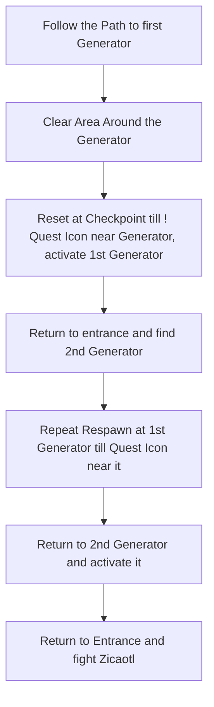

# Jiquani's Sanctum

## Zone Read

:::tip Simple Read
Follow the squared Symbols on the ground to the Generators. Clear the Area around one Generator and reset at Checkpoint till Medium Soul Core Quest Icon appears. Place Soul Core in Generator and repeat for 2nd Generator.
:::

Jiquani's Sanctum is a massive Zone where you actualy only have to discover about 40% of the Zone to complete all Objectives inside. Follow the Square Icons on the Ground towards the Generators and activate the Checkpoints.  
Clear around one of the two Generators in a Square Area and reset at Checkpoint to respawn Soul Cores until they spawn in reach.

The Middle Section contains a non itemizable Vaal Orb, however it is not guranteed to be connected to the other Side and as such it is recommended to return to Entrance to path towards the 2nd Generator after finding the first.

:::info Definitiv's Note
DO NOT RESET AT CHECKPOINT IN THIS ZONE WHiLE CARRYING A SOUL CORE! The Soul Cores are considered Local Quest Items and will drop upon Players Death or Resetting at Checkpoint. Only by placing them in their Socket will the Quest State update and Death / Reset won't reset the progression.
:::

## Layouts

### Variant Table Examples

| Required Area to discover (Only One Generator has to be cleared around)   | Full Zone                                                                   |
| ------------------------------------------------------------------------- | --------------------------------------------------------------------------- |
| .png>) | .png>) |

### Points of Interest

Large Soul Core - Zicaotl Boss fight dropping Large Soul Core and LvL 10 Skill Gem
Paquate's Mechanism - Non Itemizable Vaal Orb
