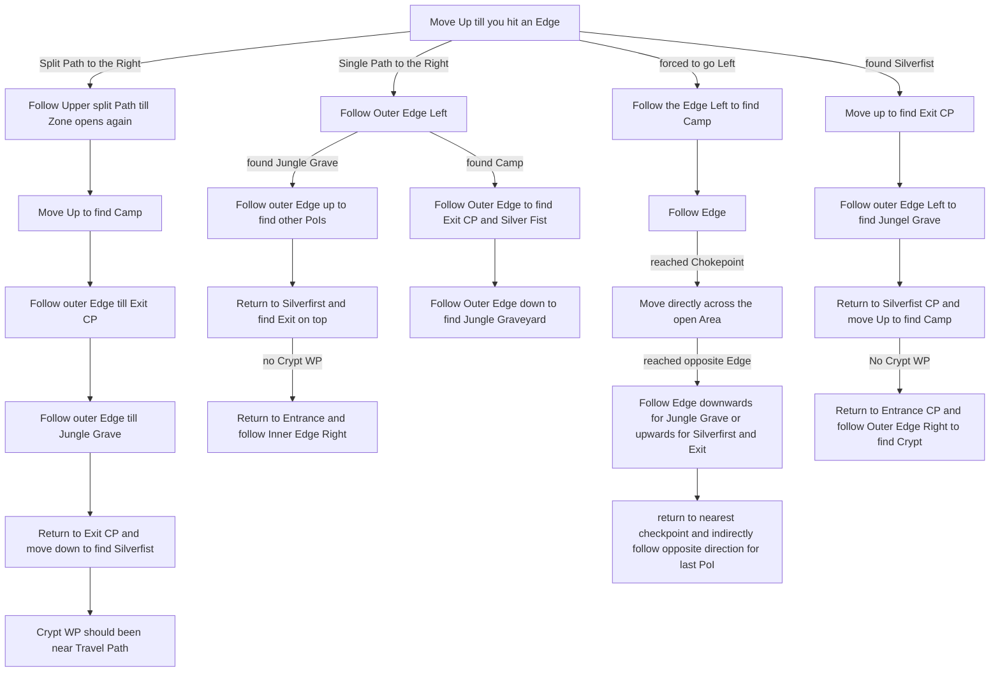
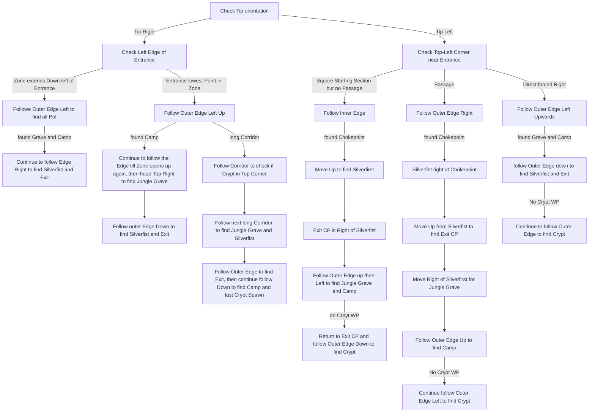

# Jungle Ruins

## Zone Read

:::tip Simple Read
The Exit is always in the same Orientation as Infested Barrens to Jungle Ruins and the Silverfist Bossfight is near the Exit.  
Due to Zone & Overworld Alignment Bugs, assume the Exit is opposite to Entrance at League Start!  
The other PoI are along the outer Edge of the Zone. Use the Brush Technique from Cemetery of the Eternals to find them
:::

:::warning Complex Zone Read
Due to having 11 Variants, all Variants being able to be mirrored AND the Zone not respecting overworld zone Connections, learning this Zone is currently not recommended beyond the Simple Rule.  
Once Overwolrd Orientation and Zone Exit align 100% of the Time the Graphs below apply with the exception of mirroring, which will be fixed in a future itteration.
Additional Layout Images will also be added in the future.
:::

Jungle Ruins has several Layouts that can be categorized. In total there are 11 Layouts, although not all have yet been discovered due to Town Orientation currently being forced. If the Town Orientation is diffrent from previous Leagues,
some rules might no longer apply.

There are 4 known North West Exit Layouts and 6 North East Exit Layouts. They can be further identified based on the Initial Zone Shape and Edges. The Starting Tile always has a Tip and a Wiggle Part along the Edge.
Depending which Side has the Tip we can further identify the Layout. The final identification is based on the following Terrain. Noticably the Venom Crypt Entrance has 2 to 3 Possible Spots for each Variant.

The Graph is split into two for easier readability.  
Top Left Exit & Tip Left Edge

Top Right Exit

## Layouts

### Variant Table Examples

|                                                                                            |                                                                                            |
| ------------------------------------------------------------------------------------------ | ------------------------------------------------------------------------------------------ |
| (Mirrored) Dead End Corner.png>) | Open Path Right .png>)         |
| (Mirrored) Early Camp .png>)   | (Mirrored) Forced Right .png>) |
| Tunnel .png>)                  |

### Points of Interest

Mighty Silverfist - 2 Weapon Set and Passive Skill Points  
Jungle Grave - Rare Belt after quick Dialog  
Troubled Camp - White 'Chest' drops guranteed Rare Gloves and Weapon Vendor
