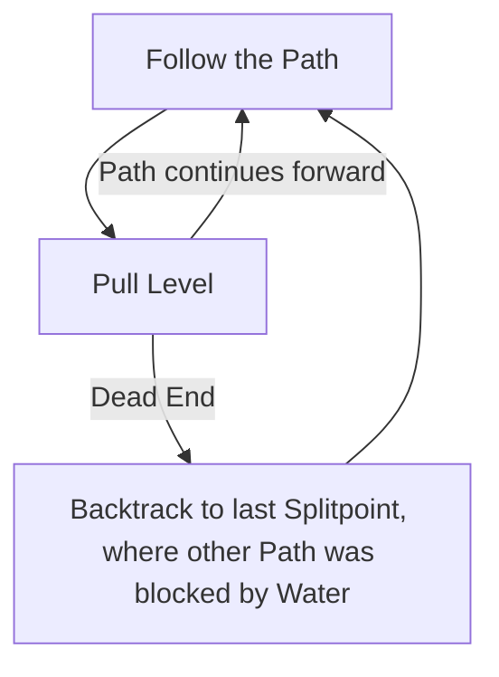

# Matlan Waterways

## Zone Read

:::tip Simple Read
Very large Snaking Linear Zone. Follow the Path from Lever to Lever.
:::

Matlan Waterways is a huge linear Zone with only ever one path forward, but a lot of snaking around. The first Section has some shortcuts from checkpoint to next checkpoint if you die. At the first Checkpoint is a Shaman's Hut, which contains a Rare that drops a guranteed Rare Staff.

## Layouts

### Variant Table Examples

| Semi-Static Layout                                                           |
| ---------------------------------------------------------------------------- |
| .png>) |

### Points of Interest

Shaman's Hut - Rare Staff  
Canal Lever - Main Quest Progression
